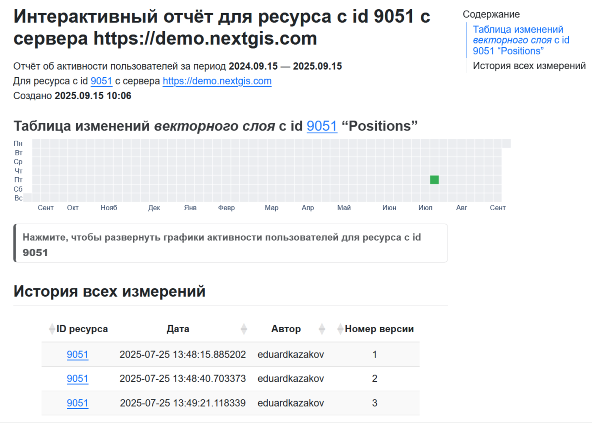

Получить отчёт об изменениях ресурса
====================================

Получить отчёт об активности пользователей для ресурса с сервера NextGIS Web.

На входе:

* Адрес NGW - адрес Веб ГИС, например, https://demo.nextgis.com);
* Логин - NextGIS ID или логин пользователя Веб ГИС;
* Пароль - пароль пользователя Веб ГИС;
* ID ресурса - цифры в конце URL ресурса в Веб ГИС;
* Начальное время - необязательный параметр. Начальная дата для отчета, указывается в формате ГГГГ-мм-дд ЧЧ:ММ:СС;
* Конечное время - необязательный параметр. Конечная дата для отчета, указывается в формате ГГГГ-мм-дд ЧЧ:ММ:СС, не менее 28 дней и не более 366 дней от начальной даты;
* Язык отчёта - язык, на котором будет сформирован отчет, можно выбрать русский или английский.

На выходе:

* Файл HTML с интерактивным отчетом об активности.

Запуск инструмента: https://toolbox.nextgis.com/t/ngw_contribution_activity

Пример работы инструмента:

   Пример полученного отчёта

**Попробуйте инструмент в действии, скачав наш пример:**

`Набор исходных данных <https://nextgis.ru/data/toolbox/ngw_contribution_activity/ngw_contribution_activity_inputs_ru.zip>`_ для проверки работы инструмента. Внутри архива пошаговая инструкция.

`Пример результата <https://nextgis.ru/data/toolbox/ngw_contribution_activity/ngw_contribution_activity_outputs_ru.zip>`_ работы инструмента.

.. admonition:: Похожие инструменты

   * `Получить историю векторного объекта <ngw_feature_history>`_
   * `Структура Веб ГИС в таблицу <https://toolbox.nextgis.com/t/web_gis_structure>`_