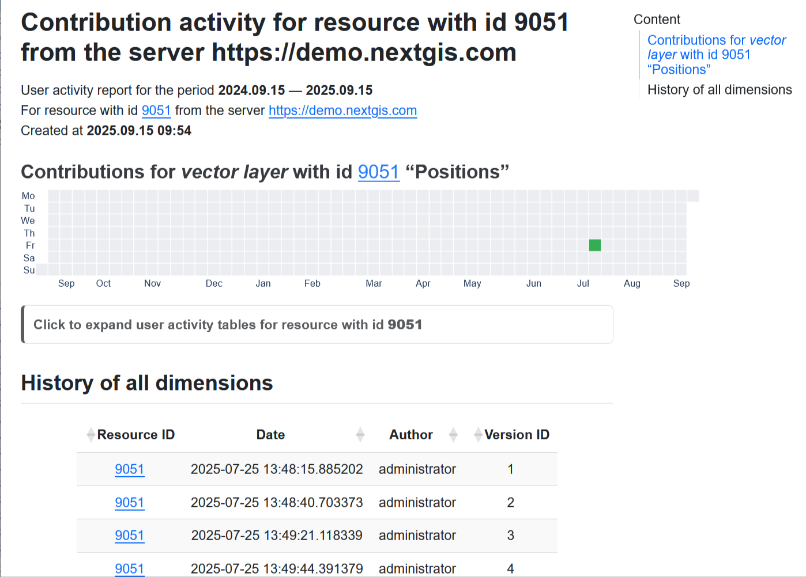

Get the contribution activity for the resource
==============================================

Get user activity report for a resource from the NextGIS Web server.

Works for one of the following resource types: 

* vector layer - you'll get user activity for a particular layer;
* resource group - all versioned vector layers within this group are analyzed;
* Web Map - all versioned layers added to the map are analyzed.

Inputs:

* NGW URL - Web GIS address (e.g., https://demo.nextgis.com);
* Login - NextGIS ID or user login;
* Password - password for that user;
* Resource ID - numbers at the end of the resource URL;
* Start time - optional. First day of the period, in YYYY-mm-dd format;
* End time - optionsl. Last day of the period, in YYYY-mm-dd format, not less than 28 days and not over 366 days from the initial date.

Outputs:

* HTML file with an interactive activity report.

Launch the tool: https://toolbox.nextgis.com/t/ngw_contribution_activity

Example:

   Example output image

**Try the tool in action**

1. Click on the **Demo** button above the tool form. The fields are filled in with demo values.
2. Click on the **Run** button.

.. admonition:: Related tools

   * `Get the history of a vector feature <https://toolbox.nextgis.com/t/ngw_feature_history?from-related-tools=1>`_
   * `Web GIS structure into spreadsheet <https://toolbox.nextgis.com/t/web_gis_structure?from-related-tools=1>`_
