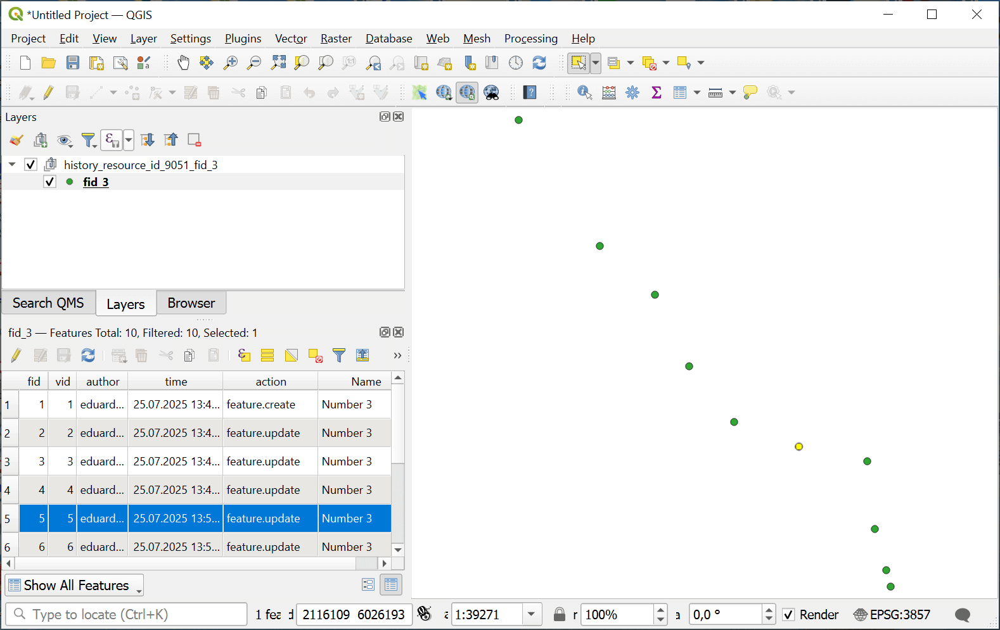

Feature history
==================================

Get the history of a feature from NextGIS Web versioned vector layer.
More on `versioning <https://docs.nextgis.com/docs_ngweb/source/version.html>`_. You can enable versionin in the `layer settings <https://docs.nextgis.com/docs_ngweb/source/layers.html#create-vector-layer-vers-pic>`_.

Inputs:

* NGW URL - Web address of the Web GIS e.g., https://example.nextgis.com;
* Login - NextGIS ID or user login;
* Password of that user;
* Resource ID of the vector layer resource - numbers at the end of the resource page link;
* Feature ID - number of the feature indicated in the ``#`` field of the feature table;
* Start time - initial timestamp for history (should be in YYYY-mm-dd HH:MM:SS format, optional);
* End time - final timestamp for history (should be in YYYY-mm-dd HH:MM:SS format, optional).

Outputs:

* Result GeoPackage. GeoPackage file with feature history versions. Each version has the geometry of the feature, attribute values plus additional fields:

   * vid - number of the version;
   * author - user who made the changes;
   * time - date and time of the edits;
   * action - what happened to the feature: created, updated, deleted, restored.

Launch the tool: https://toolbox.nextgis.com/t/ngw_feature_history

Example:

   History of changes for a point feature

**Try the tool in action**

1. Click on the **Demo** button above the tool form. The fields are filled in with demo values.
2. Click on the **Run** button.

.. admonition:: Related tools

   * `Get the Contribution activity report for resource <https://toolbox.nextgis.com/t/ngw_contribution_activity?from-related-tools=1>`_
   * `Web GIS structure into spreadsheet <https://toolbox.nextgis.com/t/web_gis_structure?from-related-tools=1>`_