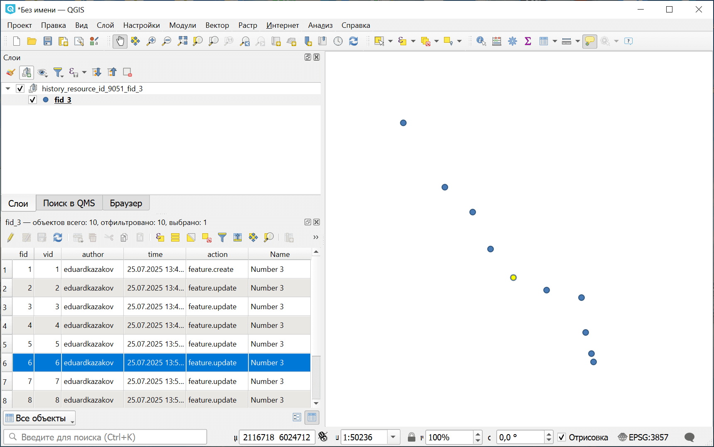

История векторного объекта
===================================

Получить историю изменений объекта из версионируемого векторного слоя NextGIS Web. Подробнее `о версионировании <https://docs.nextgis.ru/docs_ngweb/source/version.html>`_. Включить версионирование можно `в настройках слоя <https://docs.nextgis.ru/docs_ngweb/source/layers.html#create-vector-layer-vers-pic>`_.

На входе:

* Адрес NGW - адрес Веб ГИС, например, https://example.nextgis.com;
* Логин - NextGIS ID или имя пользователя Веб ГИС;
* Пароль пользователя Веб ГИС;
* ID ресурса векторного слоя - Цифры в конце ссылки на ресурс;
* ID объекта в векторном слое, находится в поле ``#``;
* Начальное время - начальная метка времени для получения истории (указывается в формате ГГГГ-мм-дд ЧЧ:ММ:СС, опционально);
* Конечное время - конечная метка времени для получения истории (указывается в формате ГГГГ-мм-дд ЧЧ:ММ:СС, опционально).

На выходе:

* Итоговый GeoPackage. Файл GeoPackage с историей изменения объекта. Для каждой версии сохраняется геометрия объекта, значения его атрибутов и следующие дополнительные атрибуты:

   * vid - номер версии
   * author - пользователь, внесший изменения
   * time - дата и время изменения
   * action - действие с объектом: создание, изменение, удаление, восстановление

Запуск инструмента: https://toolbox.nextgis.com/t/ngw_feature_history

Пример работы инструмента:

   История изменений точечного объекта

**Попробуйте инструмент в действии**

1. Нажмите кнопку **Демо** над формой инструмента. Поля будут автоматически заполнены демонстрационными значениями.
2. Нажмите кнопку **Запустить**.

.. seealso::

   * `Отчёт об изменениях ресурса <https://toolbox.nextgis.com/t/ngw_contribution_activity?from-related-tools=1>`_
   * `Структура Веб ГИС в таблицу <https://toolbox.nextgis.com/t/web_gis_structure?from-related-tools=1>`_