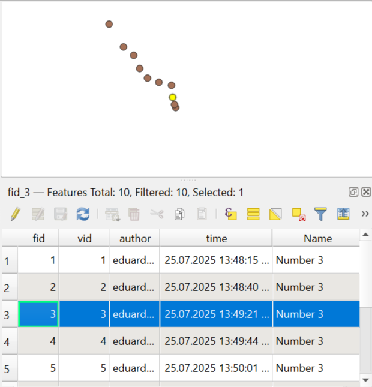

Get the history of a vector object
==================================

Get the history of a feature from NextGIS Web versioned vector layer.
More on `versioning <https://docs.nextgis.com/docs_ngweb/source/version.html>`_. You can enable versionin in the `layer settings <https://docs.nextgis.com/docs_ngweb/source/layers.html#create-vector-layer-vers-pic>`_.

Inputs:

* NGW URL - Web address of the Web GIS e.g., https://example.nextgis.com;
* Login - NextGIS ID or user login;
* Password of that user;
* Resource ID of the vector layer resource - numbers at the end of the resource page link;
* Feature ID - number of the feature indicated in the ``#`` field of the feature table;
* Start time - initial timestamp for history (should be in YYYY-mm-dd HH:MM:SS format, optional);
* End time - final timestamp for history (should be in YYYY-mm-dd HH:MM:SS format, optional).

Outputs:

* Result GeoPackage. GeoPackage file with feature history versions.

Launch the tool: https://toolbox.nextgis.com/t/ngw_feature_history

Example:

   History of changes for a point feature

**Try the tool in action by downloading our example:**

`Input data set <https://nextgis.ru/data/toolbox/ngw_feature_history/ngw_feature_history_inputs.zip>`_ to test the tool. The archive contains step-by-step instructions.

`Result example <https://nextgis.ru/data/toolbox/ngw_feature_history/ngw_feature_history_outputs.zip>`_ of the tool run.

.. admonition:: Related tools

   * `Get the contribution activity for the resource <https://toolbox.nextgis.com/t/ngw_contribution_activity>`_
   * `Web GIS structure into spreadsheet <https://toolbox.nextgis.com/t/web_gis_structure>`_