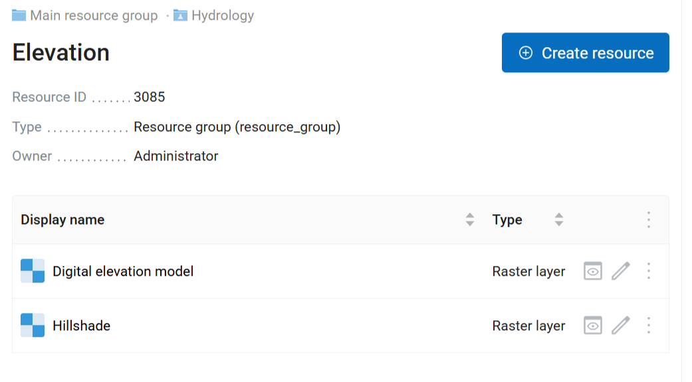
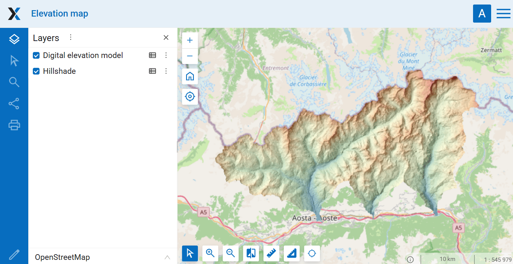

Resource group to web map
=========================

Creates a Web Map from vector and raster layers of a resource group. Web Map extent is set to the combined extent of all the layers.

Inputs:

* Web GIS address - URL of your Web GIS, e.g. https://demo.nextgis.com and login/password if necessary;
* Resource group ID - number at the end of the link to the folder with layers. For Main resource group ID=0;
* Web Map name - name of the Web Map to create. If not set, a name will be generated automatically (group name + "map");
* Create default style - if a layer has no style, creates a default one instead of skipping the layer. If disabled, layers with no styles are not included in the Web Map;
* Overwrite Web Map. If a Web Map with the same name already exists in the resource group, replace it.

Outputs:

* Link to the Web Map;
* Error log

Launch the tool: https://toolbox.nextgis.com/t/ngw_group2webmap

Example:

   Source group containing raster layers

   Resulting Web Map

**Try the tool in action**

1. Click on the **Demo** button above the tool form. The fields are filled in with demo values.
2. Click on the **Run** button.

.. admonition:: Related tools

   * `Vector layers from an archive to Web GIS <https://toolbox.nextgis.com/t/layers2ngw?from-related-tools=1>`_
   * `Vector layers from Web GIS to GeoPackage <https://toolbox.nextgis.com/t/ngw_to_gpkg?from-related-tools=1>`_