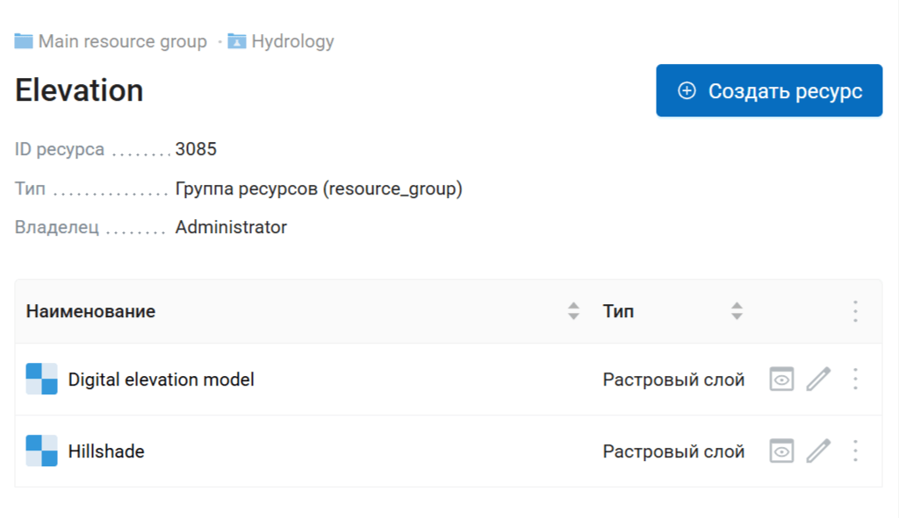
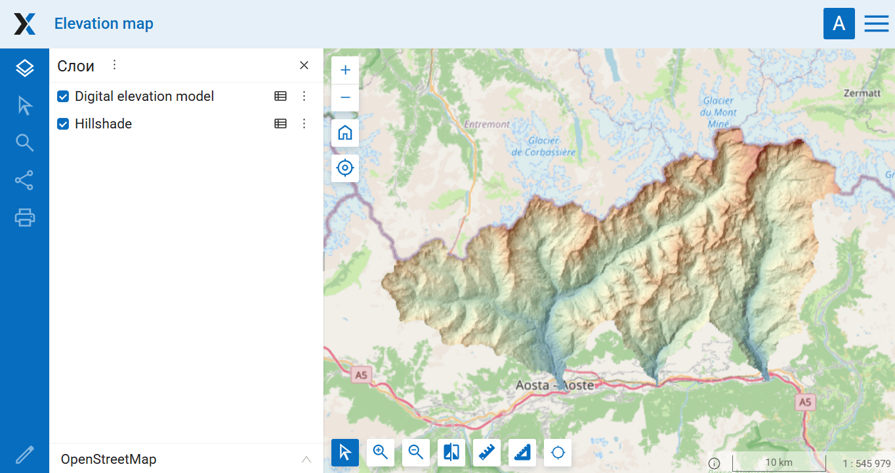

Группа ресурсов в веб-карту
===========================

Создание веб-карты из векторных и растровых слоёв группы ресурсов. Охват веб-карты выставляется по совокупному охвату всех слоёв. Веб-карта создаётся внутри выбранной группы.

На входе:

* Адрес Веб ГИС - ссылка на Веб ГИС на платформе NextGIS Web вида https://demo.nextgis.com и логин/пароль если необходимо;
* ID группы ресурсов - номер, которым заканчивается адрес папки со слоями в строке браузера. Для Основной группы ресурсов ID=0;
* Название создаваемой веб-карты. Если не задано, будет сгенерировано автоматически (название группы + "map";
* Создавать стиль по умолчанию - если у слоя нет стиля, создать стиль по умолчанию. Если отключено, такой слой будет пропущен;
* Перезаписывать веб-карту - если веб-карта с таким же именем уже есть в группе ресурсов, заменить её.

На выходе:

* Ссылка на веб-карту;
* Отчет об ошибках.

Запуск инструмента: https://toolbox.nextgis.com/t/ngw_group2webmap

Пример работы инструмента:

   Пример исходных данных: папка с двумя слоями

   Пример результата работы инструмента: веб-карта с этими слоями

**Попробуйте инструмент в действии:**

1. Нажмите кнопку **Демо** над формой инструмента. Поля будут автоматически заполнены демонстрационными значениями.
2. Нажмите кнопку **Запустить**.

.. seealso::

   * `Векторные слои из архива в Веб ГИС <https://toolbox.nextgis.com/t/layers2ngw?from-related-tools=1>`_
   * `Векторные слои из Веб ГИС в GeoPackage <https://toolbox.nextgis.com/t/ngw_to_gpkg?from-related-tools=1>`_