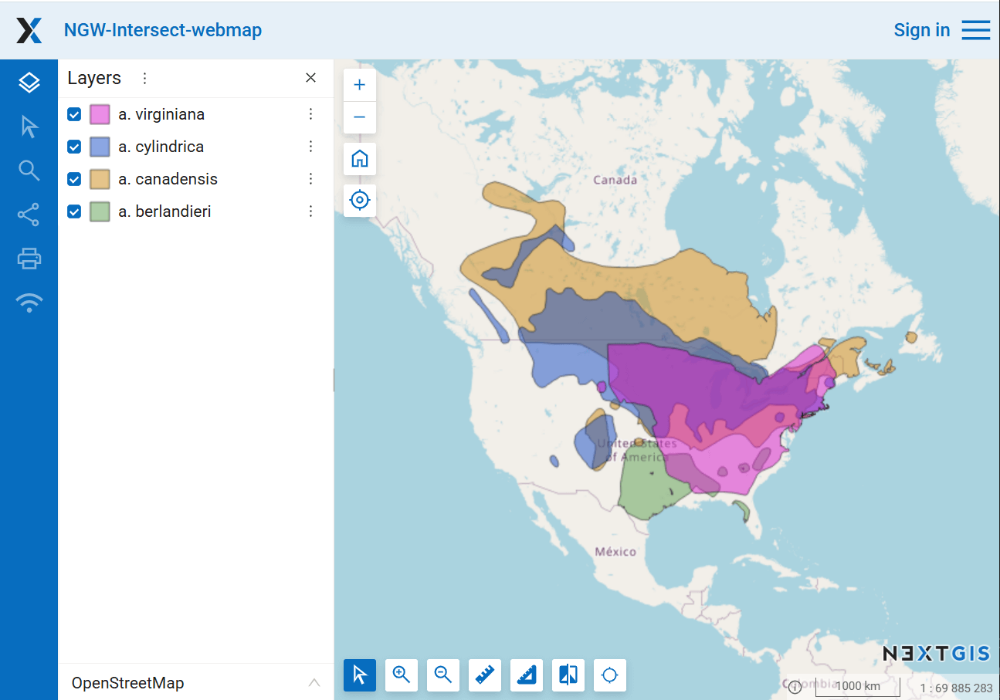
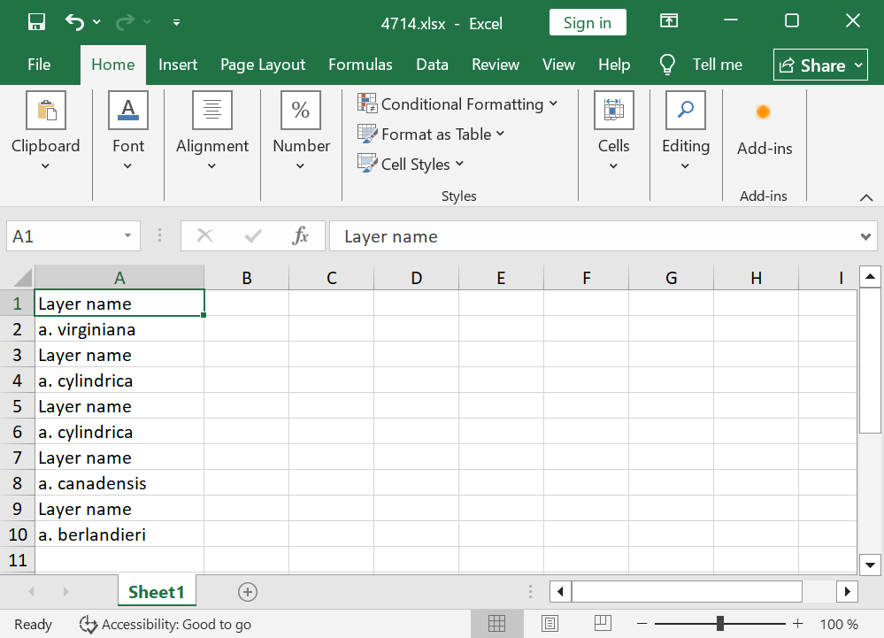

Intersection registry for Web GIS
===========

The tool intersects all layers of the nextgis.com web map using the specified geometry and generates a report for each layer. 

Inputs:

* Web GIS address. NextGIS Web URL, e.g.: https://sandbox.nextgis.com;
* Web Map ID. Numbers at the end of the Web Map URL;
* WKT geometry. Geometry for intersection in WKT format. Coordinate system: EPSG:3857.

Outputs:

*  XLSX table with a list of intersected layers.

Launch the tool: https://toolbox.nextgis.com/t/ngw-intersect
	
Example:

   Example input

   Example output

**Try the tool in action**

1. Click on the **Demo** button above the tool form. The fields are filled in with demo values.
2. Click on the **Run** button.

.. admonition:: Related tools

   * `Layer intersection <https://toolbox.nextgis.com/t/vectorclip?from-related-tools=1>`_