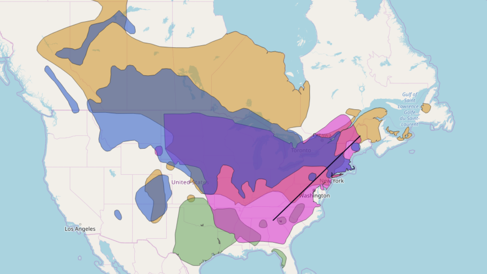
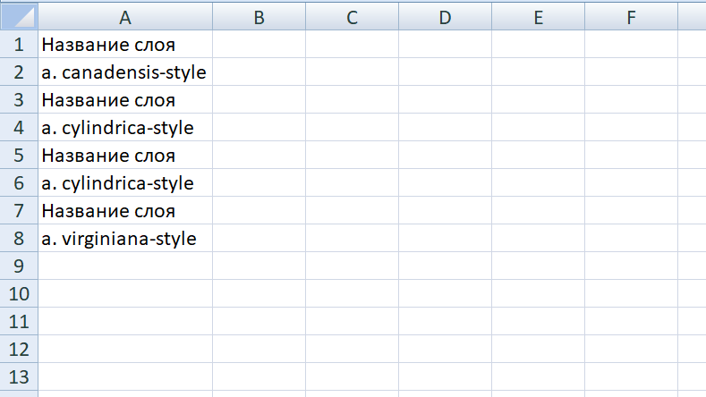

Пересекатор
===========

Сопоставляет заданную геометрию со всеми слоями веб-карты на платформе nextgis.com и выдает отчет о пересечении объектов слоёв этой карты с заданной геометрией.

На входе:

* Адрес Веб ГИС. Пример: https://sandbox.nextgis.com;
* ID Веб карты. Идентификатор ресурса Веб карты;
* Геометрия в WKT. Геометрия объекта для пересечения в формате WKT. Система координат: EPSG:3857.

На выходе:

*  таблица в формате XLSX с перечнем пересеченных слоев.

Запуск инструмента: https://toolbox.nextgis.com/t/ngw-intersect
 

   
   Пример исходных данных 
   

   
   Пример результата работы инструмента 
   
**Попробуйте инструмент в действии, скачав наш пример:**

`Набор исходных данных <https://nextgis.ru/data/toolbox/ngw_intersect/ngw_intersect_inputs_ru.zip>`_ для проверки работы инструмента. Внутри архива пошаговая инструкция.

`Пример результата <https://nextgis.ru/data/toolbox/ngw_intersect/ngw_intersect_outputs_ru.zip>`_ работы инструмента.
