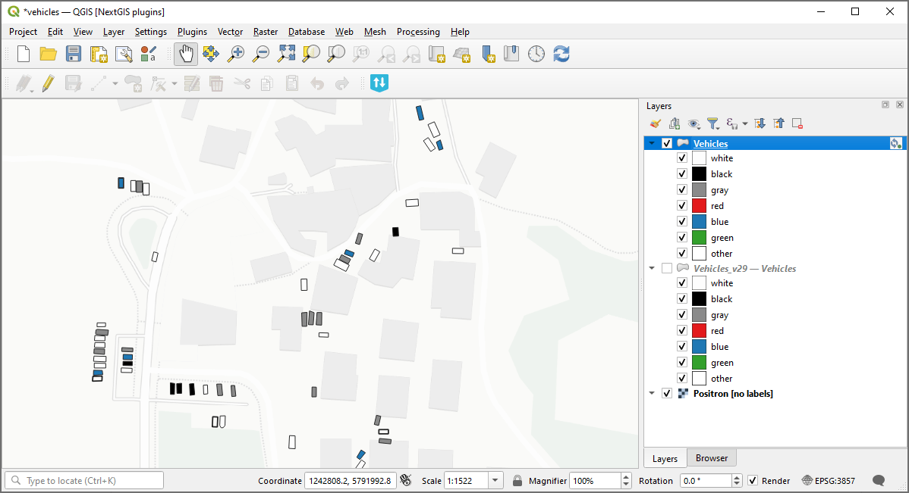
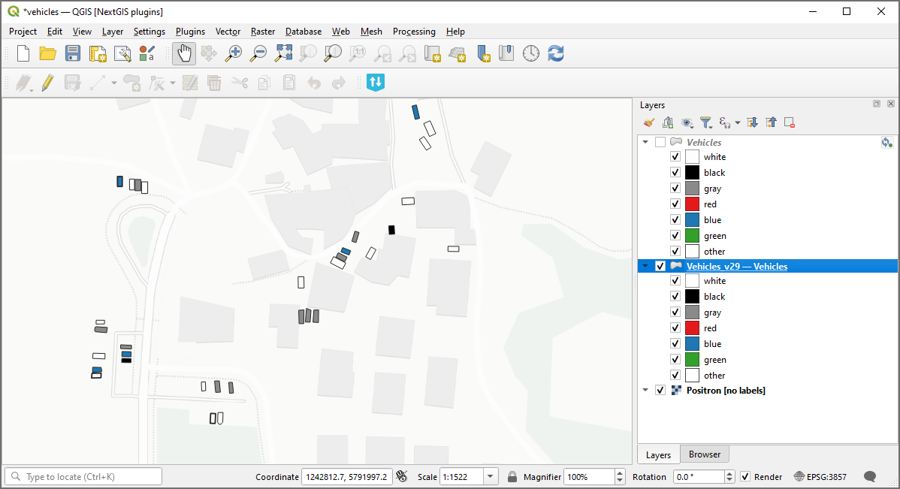

Get the layer historical state
==============================

Get a GPKG file with the state of the NextGIS Web versioned vector layer at a certain point in time or at the time of a certain version.

Learn more about `versioning <https://docs.nextgis.com/docs_ngweb/source/version.html>`_.

Inputs:

* Web GIS address - URL of your Web GIS on NextGIS platform, e.g. https://sandbox.nextgis.com, NextGIS ID and password;
* Layer ID - numbers at the end of the vector layer URL in NextGIS Web;
* Select the version of the layer you wish to download using **one of the options**:

   1) Timestamp - indicate a moment in YYYY-mm-dd HH:MM:SS format, the tool will automatically pick the corresponding version. Use this field OR the 'Version ID' field.
   2) Version ID - ID of the target version, you can check the number of the current version `via API <https://docs.nextgis.com/docs_ngweb/source/version.html#vers-ngw-api>`_. Enter an integer equal or below the current version number. Use this field OR the 'Timestamp' field.

Outputs:

* GPKG file with historical layer data.

Launch the tool: https://toolbox.nextgis.com/t/ngw_layer_historical_state

Example:

   Example input: current state of the Web GIS layer added to QGIS via NextGIS Connect

   Example output: version 29 of the layer

**Try the tool in action**

1. Click on the **Demo** button above the tool form. The fields are filled in with demo values.
2. Click on the **Run** button.

.. admonition:: Related tools

   * `Feature history <https://toolbox.nextgis.com/t/ngw_feature_history?from-related-tools=1>`_
   * `Contribution activity report for resource <https://toolbox.nextgis.com/t/ngw_contribution_activity?from-related-tools=1>`_