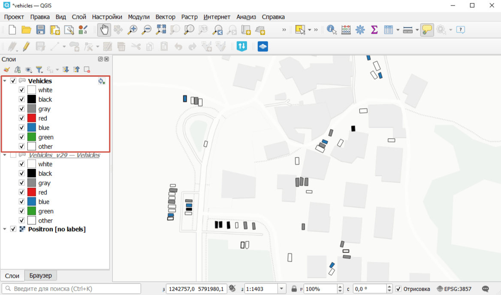
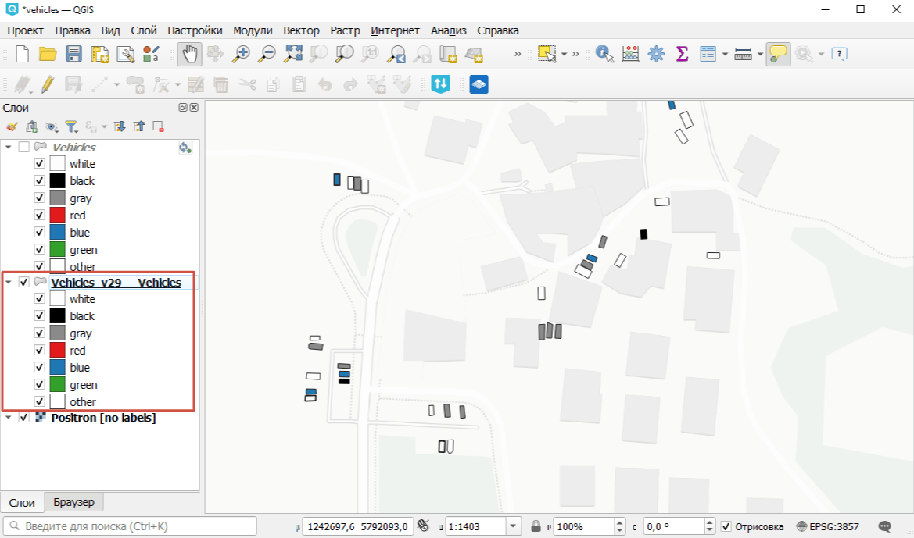

Слой по состоянию на определённую версию
========================================

Получить GPKG файл с состоянием версионируемого векторного слоя NextGIS Web на определенный момент времени или на момент определенной версии.

Узнайте больше о работе версионирования в `документации <https://docs.nextgis.ru/docs_ngweb/source/version.html#nextgis-web>`_.

На входе:

* Адрес Веб ГИС - Ссылка на Веб ГИС на платформе NextGIS Web вида https://sandbox.nextgis.com, NextGIS ID и пароль
* ID слоя - цифры в конце ссылки на векторный слой в Веб ГИС;
* Укажите нужную версию **одним из двух способов**:

   1) Временная метка - можно задать нужный момент времени, тогда инструмент сам выберет соответствующую версию слоя. Время задаётся в формате ГГГГ-мм-дд ЧЧ:ММ:СС. Используйте это поле ИЛИ поле 'Временная метка'.
   2) ID версии - ID нужной версии слоя, текущую версию можно `получить по API <https://docs.nextgis.ru/docs_ngweb/source/version.html#vers-ngw-api>`_. Введите целое число, равное или меньше текущего номера версии. Используйте это поле ИЛИ поле 'ID версии'.

На выходе:

* Файл GPKG с состоянием слоя на заданный момент времени.

Запуск инструмента: https://toolbox.nextgis.com/t/ngw_layer_historical_state

Пример работы инструмента:

   Пример исходных данных: актуальное состояние слоя Веб ГИС, подключённого через NextGIS Connect

   Пример результата работы инструмента: состояние слоя на момент версии 29

**Попробуйте инструмент в действии, скачав наш пример:**

1. Нажмите кнопку **Демо** над формой инструмента. Поля будут автоматически заполнены демонстрационными значениями.
2. Нажмите кнопку **Запустить**.

.. admonition:: Связанные инструменты

   * `История векторного объекта <https://toolbox.nextgis.com/t/ngw_feature_history?from-related-tools=1>`_
   * `Отчёт об изменениях ресурса <https://toolbox.nextgis.com/t/ngw_contribution_activity?from-related-tools=1>`_