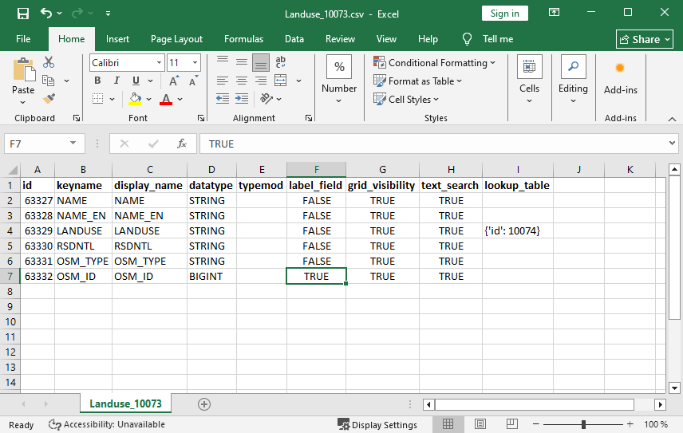

Настройки таблицы в CSV
=======================

Сохранение настроек и схемы таблицы векторного ресурса НекстГИС Веб в файл CSV. Либо обновление настроек таблицы из файла CSV.

На входе:

* Адрес Веб ГИС. Ссылка на Веб ГИС на платформе NextGIS Web вида https://demo.nextgis.com - ``обязательное поле``;
* ID векторного слоя в Веб ГИС. Цифры в конце URL существующего векторного слоя в Веб ГИС - ``обязательное поле``;
* Новые настройки - если вы хотите изменить структура слоя, добавьте CSV файл c настройками (или ZIP архив, где этот файл лежит в корне).

На выходе:

* ZIP-архив, содержащий CSV файл с информацией о полях слоя;

или

* при загрузке новых настроек - изменение существующего векторного слоя в Веб ГИС и ZIP-архив, содержащий CSV файл с исходными настройками.

Для каждого поля слоя записываются следующие параметры:

* id - идентификатор поля;
* keyname - ключ;
* display_name - наименование;
* datatype - тип данных;
* typemod;
* label_field - выбрано ли как атрибут наименование;
* grid_visibility - отображается ли в таблице;
* text_search - включён ли текстовый поиск;
* lookup_table - подключён ли к полю справочник, если да - отображается его номер ресурса.

`Подробнее о настройках полей векторного слоя <https://docs.nextgis.ru/docs_ngweb/source/layers_settings.html#ngw-attributes-edit>`_.

Если вы хотите при помощи инструмента изменить свойства полей:

1. Сгенерируйте при помощи инструмента файл CSV текущих настроек полей.
2. Откройте его в Excel или текстовом редакторе и измените нужные настройки. Изменить можно:

* keyname - не должно быть пустым или дублировать другое существующее поле, можно использовать только простую латиницу, цифры и нижнее подчёркивание, без пробелов;
* display_name  - не должно быть пустым или дублировать другое существующее поле;
* label_field - может иметь значение FALSE или TRUE, только одно поле слоя может быть выбрано;
* grid_visibility - может иметь значение FALSE или TRUE;
* text_search - может иметь значение FALSE или TRUE.

Запуск инструмента: https://toolbox.nextgis.com/t/ngw_layer_schema

Пример работы инструмента:

   Результат для слоя Landuse: в качестве атрибута наименования выбрано поле OSM_ID, к полю LANDUSE добавлен справочник

**Попробуйте инструмент в действии, скачав наш пример:**

1. Нажмите кнопку **Демо** над формой инструмента. Поля будут автоматически заполнены демонстрационными значениями.
2. Нажмите кнопку **Запустить**.

