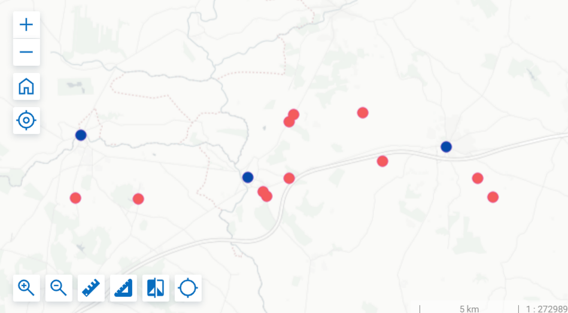
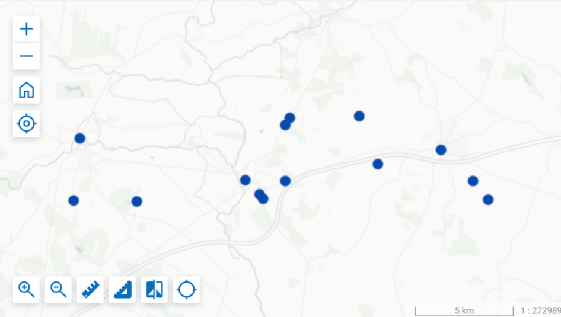

Объединить два векторных слоя в Веб ГИС
=======================================

Инструмент копирует содержимое одного слоя в другой, включая вложения и значения атрибутов в соответствии со структурой целевого слоя.

**Исходный слой** - слой, из которого копируются объекты.

**Целевой слой** - слой, в который будут вставлены объекты из исходного.

На входе:

* Адрес Веб ГИС с исходным слоем (из него будут скопированы объекты), например: https://sandbox.nextgis.com;
* Идентификатор исходного слоя - число, которым заканчивается адрес ресурса этого слоя в строке браузера;
* Исходный логин - NextGIS ID или имя пользователя Веб ГИС, где расположен исходный слой. Пользователь должен иметь права на чтение ресурса и данных;
* Исходный пароль - пароль пользователя;
* Адрес Веб ГИС с целевым слоем (в который будут вставлены объекты из исходного слоя), например: https://sandbox.nextgis.com. Может быть та же Веб ГИС, что для исходного слоя.
* Идентификатор целевого слоя - число, которым заканчивается адрес ресурса этого слоя в строке браузера;
* Логин целевой Веб ГИС - NextGIS ID или имя пользователя Веб ГИС, где расположен целевой слой. Пользователь должен иметь права на создание ресурсов в целевой Веб ГИС;
* Пароль целевой Веб ГИС.

На выходе:

* Изменённый слой в целевой Веб ГИС.

Запуск инструмента: https://toolbox.nextgis.com/t/ngw_merge_layers

   Пример исходных данных: два слоя (исходный - красный, целевой - синий)

   Результат работы инструмента: в одном слое все объекты

**Попробуйте инструмент в действии, скачав наш пример:**

`Набор исходных данных <https://nextgis.ru/data/toolbox/ngw_merge_layers/ngw_merge_layers_inputs_ru.zip>`_ для проверки работы инструмента. Внутри архива пошаговая инструкция.

`Пример результата <https://nextgis.ru/data/toolbox/ngw_merge_layers/ngw_merge_layers_outputs_ru.zip>`_ работы инструмента.
