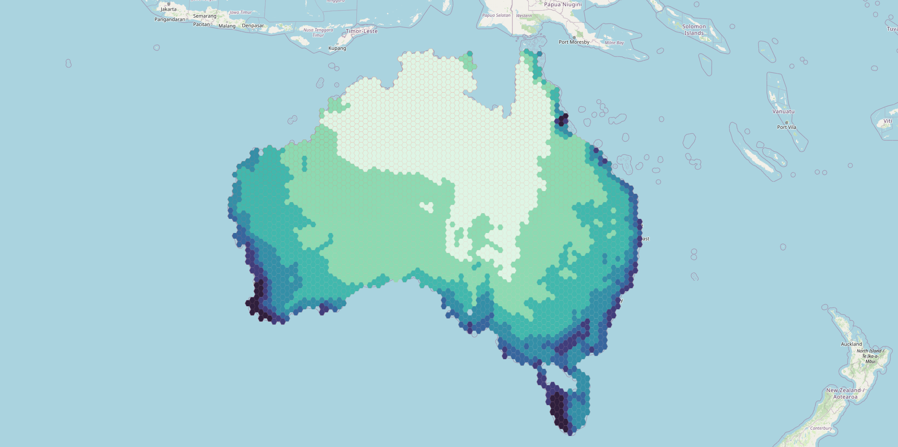

Web Map to image
================

Save Web map as a PNG image file.

Inputs:

* Link to Web map on NextGIS Web platform. Example: https://demo.nextgis.com/resource/7796/display?panel=layers. Open the Web Map and copy the link from the browser address bar.

By default, the image contains what's visible for Guest, i.e. anyone who's not logged in. To check the visibility of the data, click on the user icon in the top right and click "Sign out".

If you want to use a private Web Map, enter the credentials:

* Web GIS address - URL of your Web GIS, e.g. https://demo.nextgis.com 
* Login - NextGIS ID email address;
* Password

You can also configure the image size:

* Output width in pixels. Optional. Default: 2048.
* Output height in pixels. Optional. Default: 1152.

The initial extent of the Web Map is fit into the rectangle of the indicated proportions.

Outputs:

* Image in PNG format

Launch the tool: https://toolbox.nextgis.com/t/ngw_webmap2image

Example:

   Map in the web interface of the Web GIS

   Example output image

**Try the tool in action**

1. Click on the **Demo** button above the tool form. The fields are filled in with demo values.
2. Click on the **Run** button.

.. admonition:: Related tools

   * `Web Map to QGIS project <https://toolbox.nextgis.com/t/webmap2qgis>`_
   * `Generate raster tiles from QGIS project <https://toolbox.nextgis.com/t/qgis_rastertiles>`_
   * `QGIS project to PDF <https://toolbox.nextgis.com/t/qgis2pdf>`_