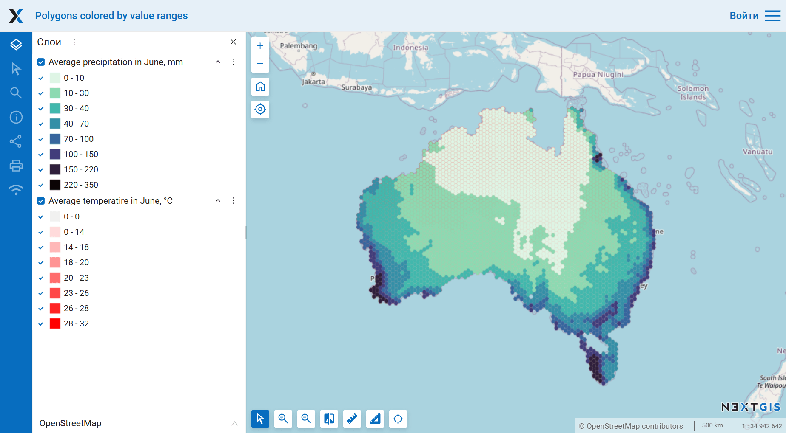

Веб-карта в изображение
=======================

Сохранить Веб-карту, размещённую на платформе NextGIS, как картинку в формате PNG. Этот инструмент позволяет получить картинку карты в нужном размере, независимо от того, какой у вас экран.

На входе:

* Ссылка на Веб-карту на платформе NextGIS, например: https://demo.nextgis.com/resource/7796/display?panel=layers. Чтобы получить такую ссылку, откройте веб-карту и скопируйте ссылку из браузера. 

По умолчанию карта будет отрисована в том виде, в каком она видна пользователю "Гость". Чтобы проверить, что видно на карте, нажмите на иконку пользователя и выберите "Выйти". Если вы хотите получить изображение приватной карты, заполните данные для входа:

* Адрес Веб ГИС - ссылка на Веб ГИС на платформе NextGIS Web вида https://demo.nextgis.com
* Логин - адрес электронной почты, на который заведён NextGIS ID;
* Пароль.

Также можно задать параметры изображения:

* Ширина изображения в пикселях. Опционально. По умолчанию: 2048.
* Высота изображения в пикселях. Опционально. По умолчанию: 1152.

Начальный охват карты будет вписан в прямоугольник заданных размеров.

На выходе:

* Картинка в формате PNG.

Запуск инструмента: https://toolbox.nextgis.com/t/ngw_webmap2image

Пример работы инструмента:

   Карта в веб-интерфейсе NextGIS Web

.. figure:: _static/ngw_webmap2image_result.png
   :name: ngw_webmap2image_result_pic
   :align: center
   :width: 20cm

   Пример полученного изображения

**Попробуйте инструмент в действии, скачав наш пример:**

1. Нажмите кнопку **Демо** над формой инструмента. Поля будут автоматически заполнены демонстрационными значениями.
2. Нажмите кнопку **Запустить**.

.. admonition:: Related tools

   * `Веб-карта в проект QGIS <https://toolbox.nextgis.com/t/webmap2qgis?from-related-tools=1>`_
   * `Растровые тайлы из проекта QGIS <https://toolbox.nextgis.com/t/qgis_rastertiles?from-related-tools=1>`_
   * `Проект QGIS в PDF <https://toolbox.nextgis.com/t/qgis2pdf?from-related-tools=1>`_