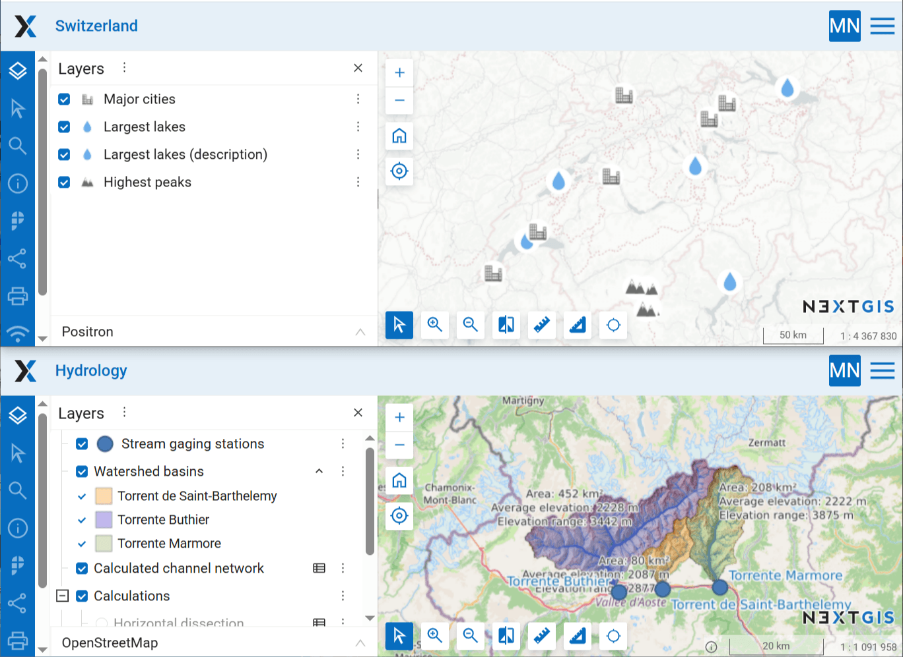
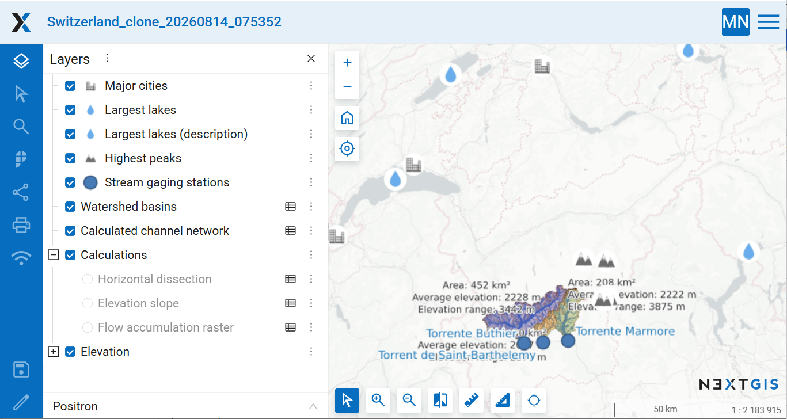

Combine two Web Maps into a new one
===================================

Combines two Web Maps into a new one. First Web Map is cloned and second Web Map layers are added to the new one.

Inputs:

* Web GIS address. Fill in the URL of your Web GIS, e.g. https://demo.nextgis.com and login/password;
* Web Map 1 ID. First Web Map for combining, the ID is the numbers at the end of the URL;
* Web Map 2 ID. Second Web Map for combining, the ID is the numbers at the end of the URL;

Outputs:

* New combined Web Map in Web GIS.

Launch the tool: https://toolbox.nextgis.com/t/ngw_webmap_combiner

Example:

   Source maps

   Example output

**Try the tool in action**

1. Click on the **Demo** button above the tool form. The fields are filled in with demo values.
2. Click on the **Run** button.

.. admonition:: Related tools

   * `Web Map into QGIS project <https://toolbox.nextgis.com/t/webmap2qgis?from-related-tools=1>`_
   * `ngw_webmap2image <https://toolbox.nextgis.com/t/ngw_webmap2image?from-related-tools=1>`_
   * `Resource group to web map <https://toolbox.nextgis.com/t/ngw_group2webmap?from-related-tools=1>`_