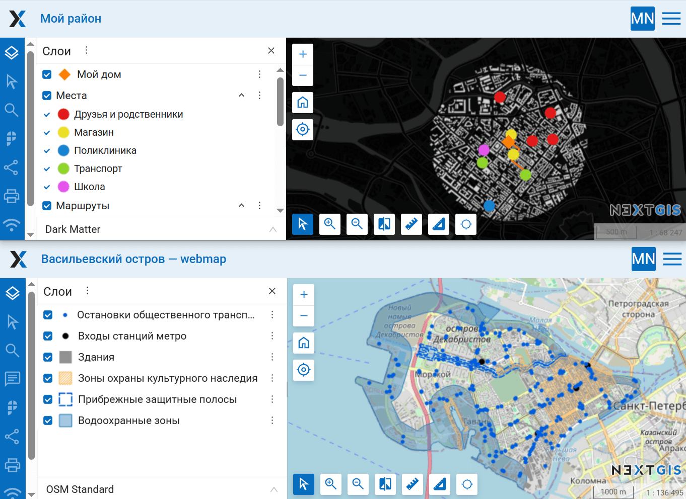
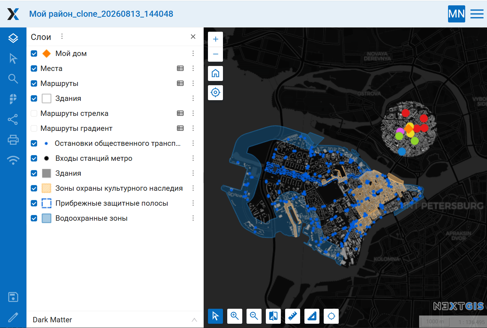

Объединение двух веб-карт в новую
=================================

Объединяет две веб-карты в новую. Первая веб-карта клонируется, а слои второй веб-карты добавляются к новой.

На входе:

* Адрес Веб ГИС. Заполните ссылку на Веб ГИС на платформе NextGIS Web вида https://demo.nextgis.com и логин/пароль;
* ID веб-карты 1. Первая веб-карта для объединения, ID - цифры в конце ссылки на карту;
* ID веб-карты 2. Вторая веб-карта для объединения, ID - цифры в конце ссылки на карту.

На выходе:

* Ссылка на объединённую веб-карту.

Запуск инструмента: https://toolbox.nextgis.com/t/ngw_webmap_combiner

Пример работы инструмента:

   Исходные веб-карты

   Новая объединённая веб-карта

**Попробуйте инструмент в действии:**

1. Нажмите кнопку **Демо** над формой инструмента. Поля будут автоматически заполнены демонстрационными значениями.
2. Нажмите кнопку **Запустить**.

