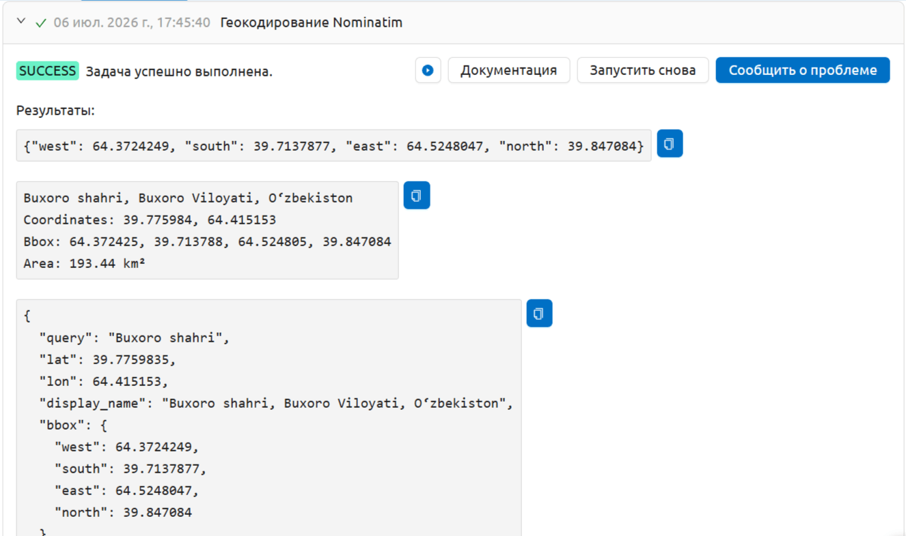

Геокодирование Nominatim
========================

Преобразование адреса или названия места в географические координаты и ограничивающий прямоугольник с помощью API OpenStreetMap Nominatim.

На входе:

* Адрес / Название места. Адрес или название места для геокодирования, например 'Basel, Switzerland' или 'Marienplatz 1, München';
* Буфер (км) - расширить ограничивающий прямоугольник на это расстояние в км (по умолчанию: 0). Полезно для создания рабочей области вокруг точечного адреса.

На выходе:

* Ограничивающий прямоугольник - JSON-строка с west, south, east, north — напрямую используется как bbox-вход для других инструментов;
* Текстовая сводка результата геокодирования;
* Полный JSON-манифест с координатами, bbox, площадью и метаданными.

Запуск инструмента: https://toolbox.nextgis.com/t/nominatim_geocode

Пример работы инструмента:

   Пример результата работы инструмента

**Попробуйте инструмент в действии:**

1. Нажмите кнопку **Демо** над формой инструмента. Поля будут автоматически заполнены демонстрационными значениями.
2. Нажмите кнопку **Запустить**.

.. seealso::

   * `Геокодировать таблицу <https://toolbox.nextgis.com/t/geocodetable?from-related-tools=1>`_
   * `Загрузка данных OSM <https://toolbox.nextgis.com/t/osm_download?from-related-tools=1>`_
