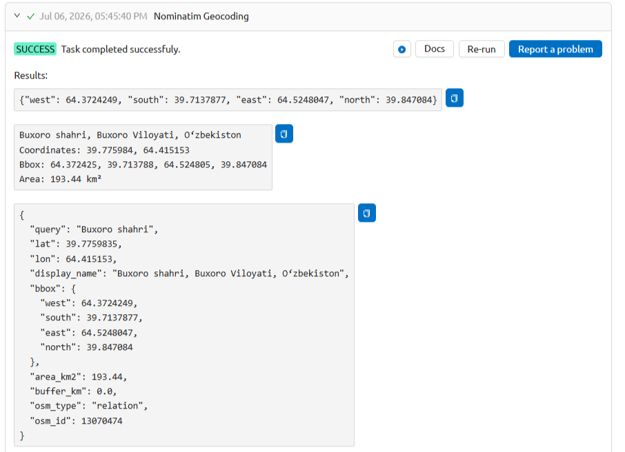

Geocode with Nominatim
======================

Convert an address or place name to geographic coordinates and a bounding box using the OpenStreetMap Nominatim API.

Inputs:

* Address / Place Name. Address or place name to geocode, e.g. ``Basel, Switzerland`` or ``Marienplatz 1, München``;
* Buffer (km). Expand the bounding box by this distance in km (default: 0). Useful to create a working area around a point address.

Outputs:

* JSON string with west, south, east, north — directly usable as bbox input for other tools;
* Human-readable geocoding result summary;
* Full JSON manifest with coordinates, bbox, area, and metadata.

Launch the tool: https://toolbox.nextgis.com/t/nominatim_geocode

Example:

   Example output

**Try the tool in action**

1. Click on the **Demo** button above the tool form. The fields are filled in with demo values.
2. Click on the **Run** button.

.. admonition:: Related tools

  * `Geocode a table <https://toolbox.nextgis.com/t/geocodetable?from-related-tools=1>`_
  * `Download OpenStreetMap <https://toolbox.nextgis.com/t/osm_download?from-related-tools=1>`_