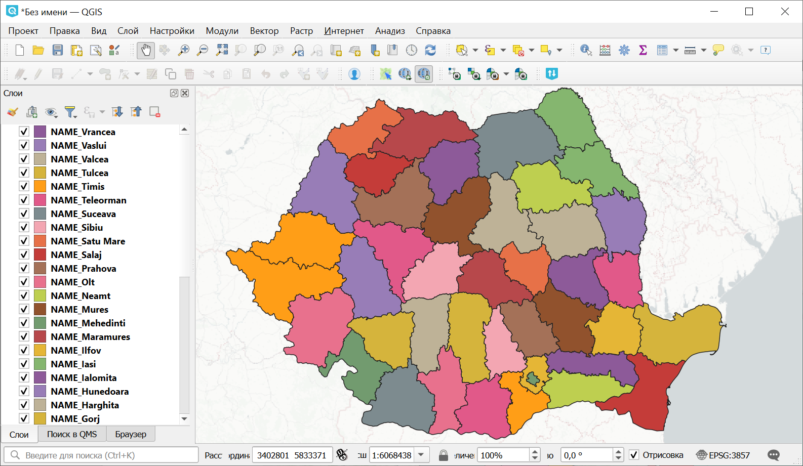
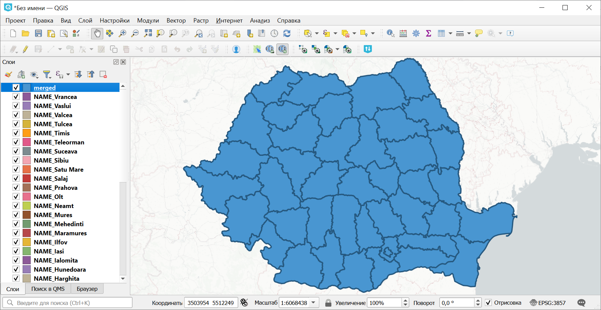

Объединение векторных слоёв
===========================

Инструмент объединяет векторные слои одного типа геометрии в один слой.

На входе:

* ZIP-архив с файлами формата ESRI Shapefile, GeoJSON, GeoPackage, MapInfo TAB. В одном архиве могут быть файлы разных форматов и с разной системой координат. Внутри архива файлы могут лежать во вложенной папке.

На выходе:

* Файл в формате GeoPackage с результатом объединения.

Ограничения на количество исходных слоёв нет. Слои склеиваются по очереди. Название исходного слоя сохраняется в атрибутах результата.

.. raw:: html

   <iframe width="720" height="405" src="https://rutube.ru/play/embed/ef96651ed566cc0ffe90e2ca910244e4/" frameBorder="0" allow="clipboard-write; autoplay" webkitAllowFullScreen mozallowfullscreen allowFullScreen></iframe>

Посмотреть видео на `youtube <https://youtu.be/s-PMUZ7Ezy8>`_, `rutube <https://rutube.ru/video/ef96651ed566cc0ffe90e2ca910244e4/>`_.

Запуск инструмента: https://toolbox.nextgis.com/t/ogrmerge

Пример работы инструмента:

   Исходные данные

   Объединённый слой

**Попробуйте инструмент в действии, скачав наш пример:**

`Набор исходных данных <https://nextgis.ru/data/toolbox/ogrmerge/ogrmerge_inputs_ru.zip>`_ для проверки работы инструмента. Внутри архива пошаговая инструкция.

`Пример результата <https://nextgis.ru/data/toolbox/ogrmerge/ogrmerge_outputs_ru.zip>`_ работы инструмента.