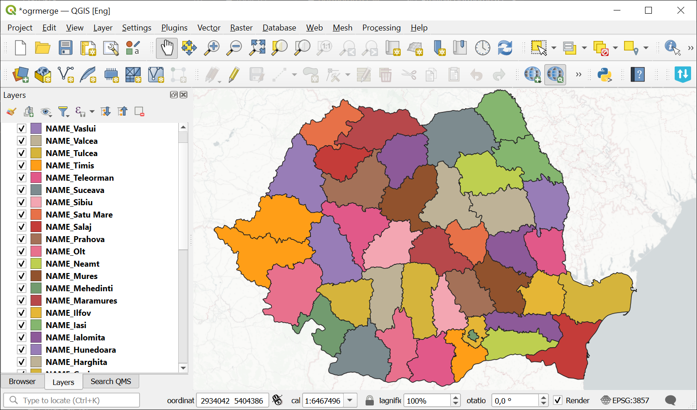
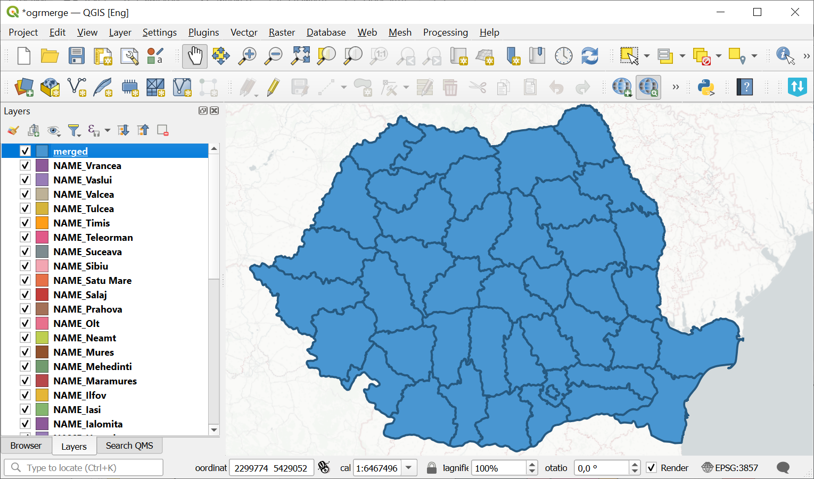

Merge vector layers
===================
   
The tool merges many vector layers into one. Layers should be of same geometry type.

Inputs:

* ZIP archive with .shp, .geojson, .gpkg, .tab layers. You can combine files of different formats and coordinate reference systems together in one set. Inside archive files can also be stored in additional common folder.

Outputs:

* GeoPackage file with the result of the merge.

The tool has no limit on the number of input layers. The name of the source layer is also saved.

Launch the tool: https://toolbox.nextgis.com/t/ogrmerge

Example:

   Example input

   Example output

**Try it out using our sample:**

Download `input dataset <https://nextgis.com/data/toolbox/ogrmerge/ogrmerge_inputs.zip>`_ to test the instrument. Step-by-step instructions included.

Get the `output <https://nextgis.com/data/toolbox/ogrmerge/ogrmerge_outputs.zip>`_ to additionally check the results.
