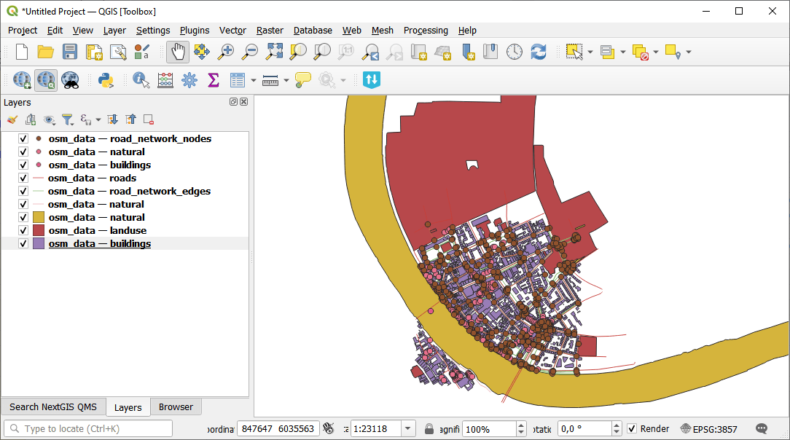

Download OpenStreetMap
======================

Download OpenStreetMap features (buildings, roads, landuse, etc.) for a given bounding box via the Overpass API. Returns a ZIP archive with a GeoPackage containing one layer per category and a manifest.

Inputs:

* Bounding box in WGS84 (west, south, east, north);
* Categories - Comma-separated OSM categories to download. Available: buildings, roads, paths, landuse, natural, waterways, amenities, shops, tourism. Default: ``buildings,roads,landuse``;
* Custom tags - JSON string with custom OSM tags, e.g. ``{"leisure": "park"}``;
* Network type. Road network type to download (only used when 'roads' category is selected):

  - Drive
  - Walk
  - Bike
  - All - default

Outputs:

* ZIP archive with a GeoPackage containing one layer per category;
* Text report with the number of features for each layer;
* JSON manifest.

Launch the tool: https://toolbox.nextgis.com/t/osm_download

Example:

   Downloaded data

**Try the tool in action**

1. Click on the **Demo** button above the tool form. The fields are filled in with demo values.
2. Click on the **Run** button.

.. admonition:: Related tools

   * `Prepare and download Sentinel-2 data <https://toolbox.nextgis.com/t/download_and_prepare_l8_s2?from-related-tools=1>`_
   * `Search & download Planetary Computer <https://toolbox.nextgis.com/t/planetary_search?from-related-tools=1>`_
   * `Clip PBF file by bbox <https://toolbox.nextgis.com/t/osmclip_bbox?from-related-tools=1>`_