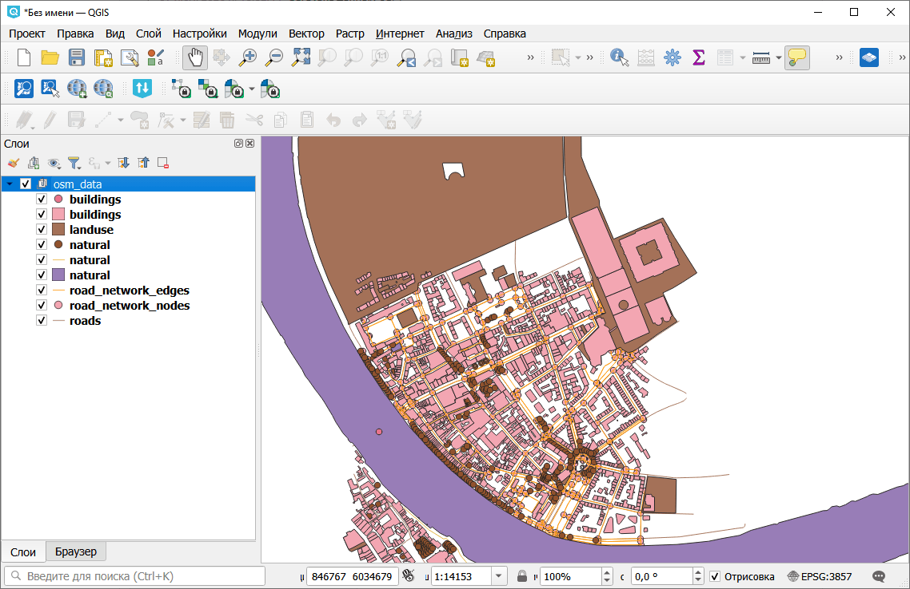

Загрузка данных OSM
===================

Загрузка объектов OpenStreetMap (здания, дороги, землепользование и др.) для заданной области через Overpass API. Возвращает ZIP-архив с GeoPackage, содержащим по слою на каждую категорию, и манифестом.

На входе:

* Ограничивающий прямоугольник - координаты в WGS84 (запад, юг, восток, север);
* Категории. Категории OSM через запятую. Доступные: buildings, roads, paths, landuse, natural, waterways, amenities, shops, tourism (по умолчанию: buildings,roads,landuse);
* Пользовательские теги - JSON-строка с пользовательскими тегами OSM, например '{"leisure": "park"}'
* Тип дорожной сети. Тип дорожной сети для загрузки (используется только при выборе категории 'roads').

  - Автомобильная (drive)
  - Пешеходная (walk)
  - Велосипедная (bike)
  - Все (all) - значение по умолчанию.

На выходе:

* ZIP-архив с файлами GeoPackage, по одному слою на каждую категорию;
* Отчет с количеством загруженных объектов по слоям;
* JSON-манифест.

Запуск инструмента: https://toolbox.nextgis.com/t/osm_download

Пример работы инструмента:

   Загруженные данные OSM

**Попробуйте инструмент в действии:**

1. Нажмите кнопку **Демо** над формой инструмента. Поля будут автоматически заполнены демонстрационными значениями.
2. Нажмите кнопку **Запустить**.

.. seealso::

   * `Подготовка и скачивание данных Sentinel-2 <https://toolbox.nextgis.com/t/download_and_prepare_l8_s2?from-related-tools=1>`_
   * `Скачивание данных Planetary Computer <https://toolbox.nextgis.com/t/planetary_search?from-related-tools=1>`_
   * `Обрезать PBF по прямоугольнику <https://toolbox.nextgis.com/t/osmclip_bbox?from-related-tools=1>`_