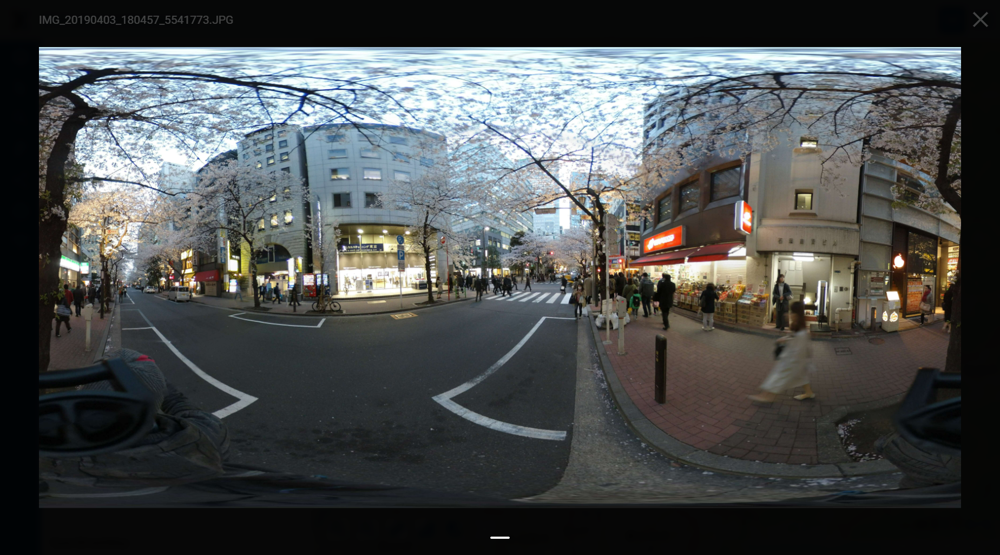
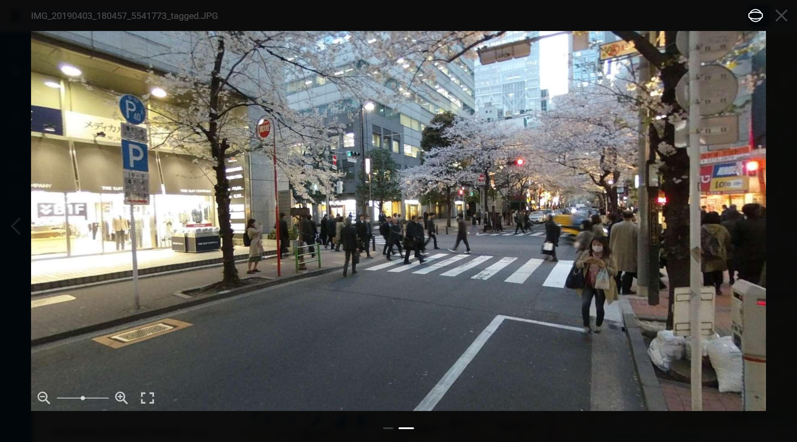

Add Google Photosphere XMP metadata to photos
=============================================

Sometimes spherical panoramic images don't have the neccessary tags which stops the viewers from displaying them correctly. This tool adds XMP tags corresponding to the `specification <https://developers.google.com/streetview/spherical-metadata>`_ that notify the viewing widget that:

* it's a spherical panoramic image;
* FOV is 360x180.

So the input image must indeed have 360x180 field of view.

GPano:PoseHeadingDegrees is copied from GPSImgDirection if it's present.

Inputs:

* ZIP with photos or single JPG file. Subfolders supported for the archive.

Outputs:

* ZIP with modified photos with added tags. All images are stored in the root of the arhcive.

You can `add spherical panoramas to features on a Web Map <https://docs.nextgis.com/docs_ngweb/source/feature_edit.html#ngw-attachments>`_ and display them in NextGIS Web.

Launch the tool: https://toolbox.nextgis.com/t/panotag

Example:

   Untagged image

   Tags allow the image to be viewed as a spherical panorama

**Try the tool in action**

1. Click on the **Demo** button above the tool form. The fields are filled in with demo values.
2. Click on the **Run** button.

.. admonition:: Related tools

   * `Geotag photos using GPX track <https://toolbox.nextgis.com/t/gpx2exif?from-related-tools=1>`_
   * `Photos with EXIF to NGW layer <https://toolbox.nextgis.com/t/exif2resource?from-related-tools=1>`_
   * `Convert Garden Gnome Package panoramas to JPEG <https://toolbox.nextgis.com/t/pano2vr?from-related-tools=1>`_
