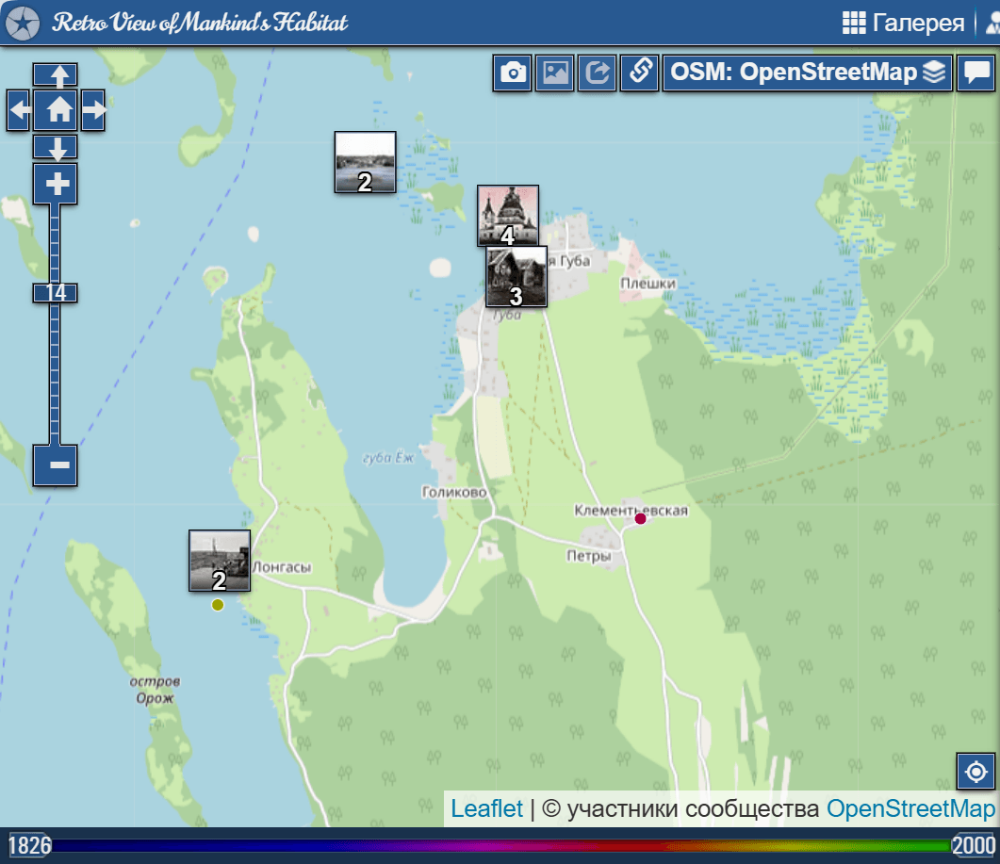
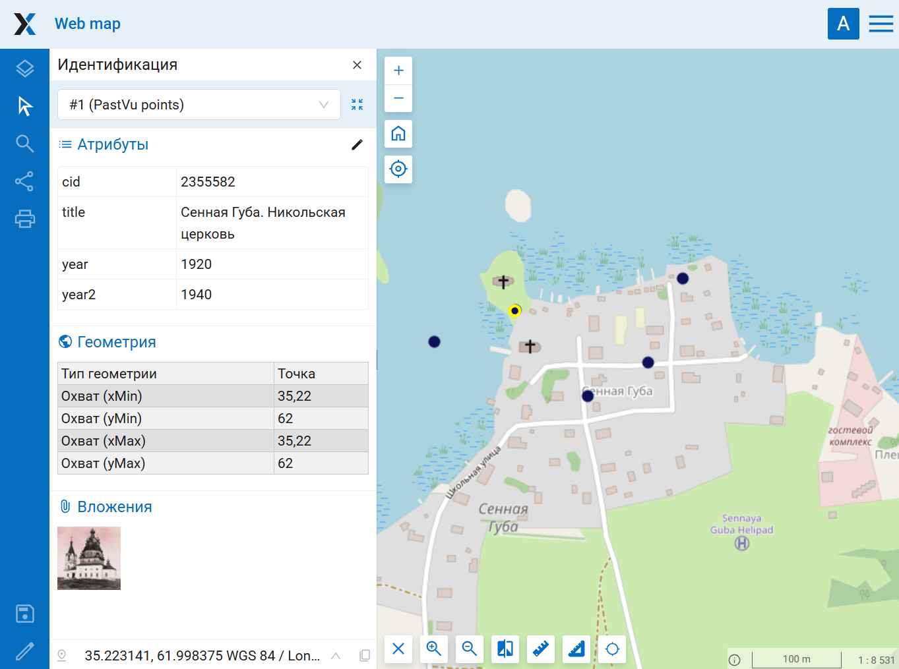

Импорт фото PastVu в Веб ГИС
============================

Перенос точек с фото из PastVu в векторный слой с вложениями.

На входе:

* Соединение с Веб ГИС - ссылка на Веб ГИС на платформе NextGIS Web вида https://demo.nextgis.com и логин/пароль если необходимо;
* Охват импорта - задайте охват на карте или впишите в географических координатах в формате низ, лево, верх, право (юг, запад, север, восток) в десятичных градусах. Площадь охвата не должна превышать 50 км²;
* Создать веб-карту - если включить эту опцию, будет создана веб-карта, на которую будет добавлен слой точек с фотографиями.

На выходе:

* Группа ресурсов;
* Веб-карта (если выбрано).

Запуск инструмента: https://toolbox.nextgis.com/t/pastvu2webgis

Пример работы инструмента:

   Пример исходных данных на pastvu

   Итоговая карта, идентифицирована точка с вложением

**Попробуйте инструмент в действии:**

1. Нажмите кнопку **Демо** над формой инструмента. Поля будут автоматически заполнены демонстрационными значениями.
2. Нажмите кнопку **Запустить**.

.. seealso::

   * `Фото с EXIF в слой NGW <https://toolbox.nextgis.com/t/exif2resource?from-related-tools=1>`_
   * `Таблица Google/Яндекс в Веб ГИС <https://toolbox.nextgis.com/t/spreadsheet2layer?from-related-tools=1>`_
