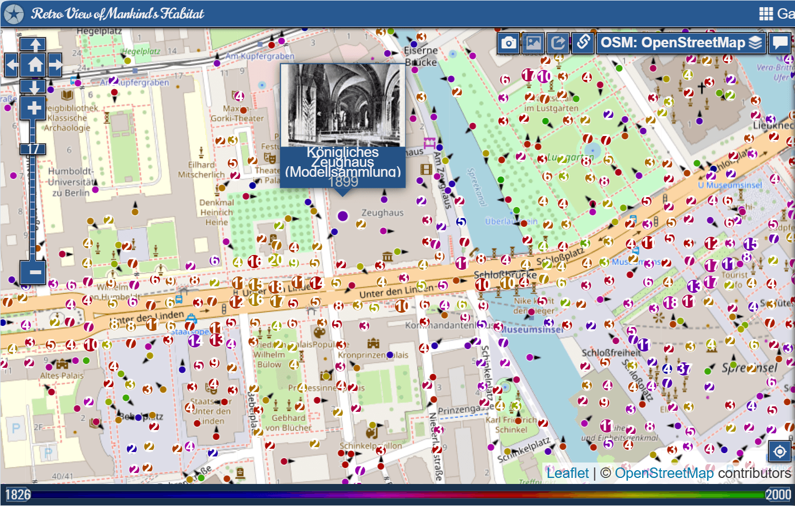
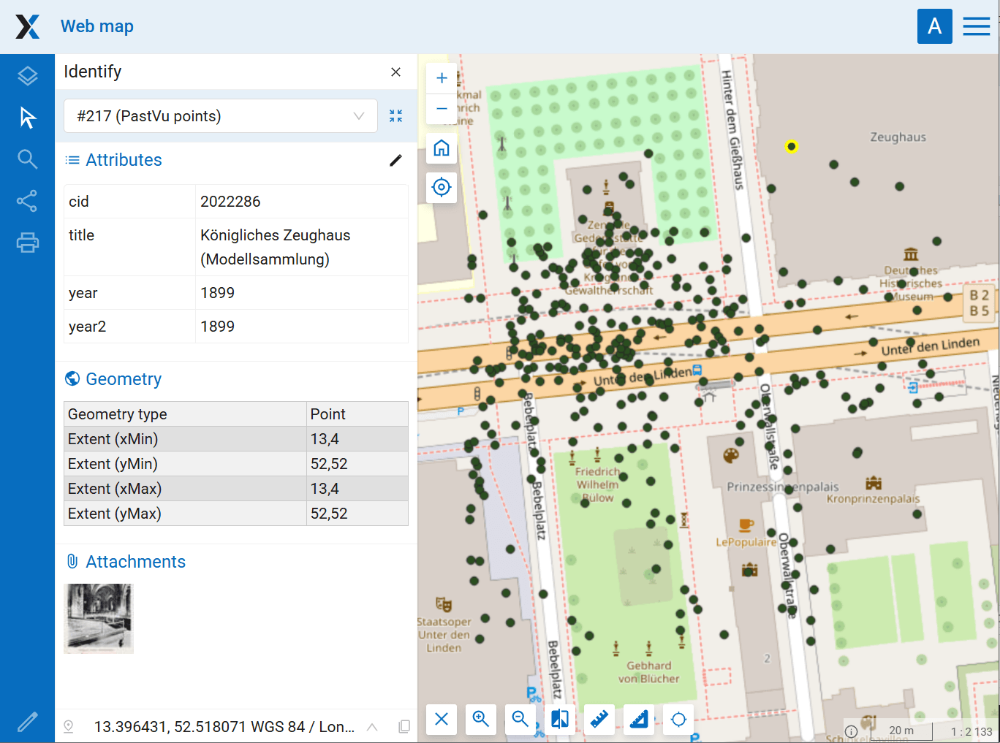

Import PastVu photos to Web GIS
===============================

Transfer points with photo from PastVu to vector layer with attachments.

Inputs:

* Web GIS connection - URL of your Web GIS, e.g. https://demo.nextgis.com and login/password if necessary;
* Import bounding box - you can mark it on a map, draw it and then correct the numbers or enter the extent manually following the format 'xmin, xmax, ymin, ymax'. Enter coordinates in WGS 84 (EPSG:4326). Bounding box area shouldn't exceed 50 km²;
* Create Web Map - check this option if you want to create a Web Map displaying the layer with photos.

Outputs:

* Resource group containing the layer with photo attachments;
* Web Map (if selected).

Launch the tool: https://toolbox.nextgis.com/t/pastvu2webgis

Example:

   An area on Pastvu

   Resulting Web Map with attached photos

**Try the tool in action**

1. Click on the **Demo** button above the tool form. The fields are filled in with demo values.
2. Click on the **Run** button.

.. admonition:: Related tools

   * `Photos with EXIF to NGW layer <https://toolbox.nextgis.com/t/exif2resource?from-related-tools=1>`_
   * `Google Sheets to Web GIS <https://toolbox.nextgis.com/t/spreadsheet2layer?from-related-tools=1>`_