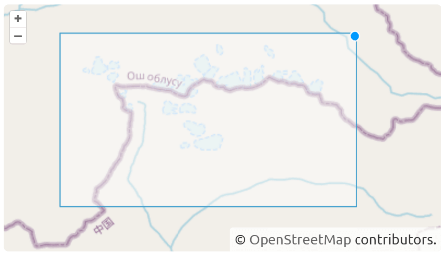
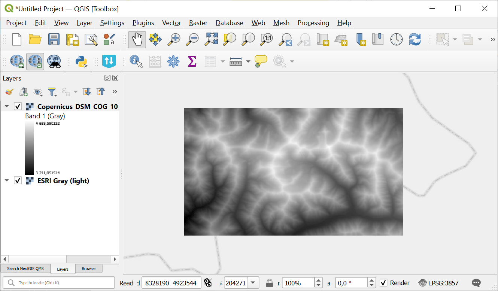

Planetary Computer Search & Download
====================================

Launch the tool: https://toolbox.nextgis.com/t/planetary_search

Search and download satellite imagery and elevation data from Microsoft Planetary Computer (Sentinel-2, Landsat, Copernicus DEM, etc.) for a given bounding box and time range. Returns a ZIP archive of GeoTIFF files.

Inputs:

* Dataset collection. Satellite/elevation data collection to search:

  - Sentinel-2 Level-2A (10-60m, 2015-present) (sentinel-2-l2a)
  - Landsat Collection 2 Level-2 (30m, 1982-present) (landsat-c2-l2)
  - Copernicus DEM Global 30m (cop-dem-glo-30)
  - Copernicus DEM Global 90m (cop-dem-glo-90)
  - NAIP Aerial Imagery (US, 0.6-1m) (naip)
  - Sentinel-1 RTC SAR (10m) (sentinel-1-rtc)
  - IO Land Use/Land Cover 9-class (10m) (io-lulc-9-class)
  - ESA WorldCover (10m) (esa-worldcover)
  - NASADEM Elevation (30m) (nasadem)
  - ALOS World 3D DEM (30m) (alos-dem)
  - MODIS Surface Reflectance 8-Day (500m) (modis-09A1-061)

* Bounding box - draw your area of interest on the map or enter coordinates in decimal degrees (West, South, East, North in WGS84);
* Start date in ISO format, e.g. ``2024-01-01``;
* End date in ISO format, e.g. ``2024-12-31``
* Max cloud cover (%) (only for optical imagery like Sentinel-2, Landsat);
* Max results - maximum number of scenes to search (between 1 and 100, default is 10);
* Asset keys - comma-separated list of asset keys to download (e.g. 'B04,B03,B02' for Sentinel-2). If empty, all GeoTIFF assets are downloaded.

Outputs:

* ZIP-archive with data;
* Report.

Example:

   Example input

   Example output

**Try the tool in action**

1. Click on the **Demo** button above the tool form. The fields are filled in with demo values.
2. Click on the **Run** button.

.. seealso::

   * `Search and save Sentinel-2 scene previews <https://toolbox.nextgis.com/t/s2_search?from-related-tools=1>`_
   * `Download Sentinel-2 satellite data <https://toolbox.nextgis.com/t/download_and_prepare_l8_s2?from-related-tools=1>`_
   * `Copernicus Sentinel image search <https://toolbox.nextgis.com/t/imagesearch?from-related-tools=1>`_
   * `Search and save Landsat-L2C2 scene previews <https://toolbox.nextgis.com/t/landsat_search?from-related-tools=1>`_
