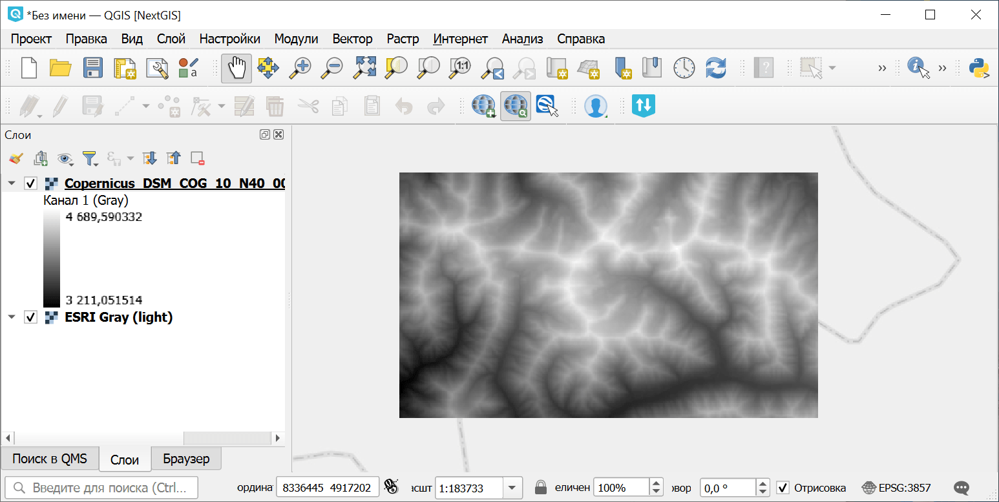

Поиск и загрузка данных Planetary Computer
==========================================

Запуск инструмента: https://toolbox.nextgis.com/t/planetary_search

Поиск и загрузка спутниковых снимков и данных высот из Microsoft Planetary Computer (Sentinel-2, Landsat, Copernicus DEM и др.) для заданной области и временного диапазона. Возвращает ZIP-архив с файлами GeoTIFF.

На входе:

* Коллекция данных. Коллекция спутниковых/высотных данных для поиска:

   - Sentinel-2 Level-2A (10-60m, 2015-present) (sentinel-2-l2a)
   - Landsat Collection 2 Level-2 (30m, 1982-present) (landsat-c2-l2)
   - Copernicus DEM Global 30m (cop-dem-glo-30)
   - Copernicus DEM Global 90m (cop-dem-glo-90)
   - NAIP Aerial Imagery (US, 0.6-1m) (naip)
   - Sentinel-1 RTC SAR (10m) (sentinel-1-rtc)
   - IO Land Use/Land Cover 9-class (10m) (io-lulc-9-class)
   - ESA WorldCover (10m) (esa-worldcover)
   - NASADEM Elevation (30m) (nasadem)
   - ALOS World 3D DEM (30m) (alos-dem)
   - MODIS Surface Reflectance 8-Day (500m) (modis-09A1-061)

* Ограничивающий прямоугольник - нарисуйте границы области интереса или задайте их в десятичных градусах (запад, юг, восток, север  в СК WGS84), например Запад: ``74.656330``, Юг: ``40.291221``, Восток: ``74.844727``, Север: ``40.374944``;
* Начальная дата в формате ISO, например ``2024-01-01``;
* Конечная дата в формате ISO, например ``2024-12-31``;
* Максимальная облачность в процентах (только для оптических данных, например Sentinel-2, Landsat)
* Макс. количество результатов - максимальное количество сцен для поиска (от 1 до 100, по умолчанию 10);
* Ключи ресурсов - список ключей ресурсов через запятую (например ``B04,B03,B02`` для Sentinel-2). Если пусто, загружаются все GeoTIFF-ресурсы.

На выходе:

* ZIP-архив с данными.
* Отчёт о количестве найденных сцен.

Пример работы инструмента:

.. figure:: _static/planetary_search_input.png
   :name: planetary_search_input_pic
   :align: center
   :width: 12cm

   Область интереса, выбранная на карте

   Пример результата работы инструмента

**Попробуйте инструмент в действии:**

1. Нажмите кнопку **Демо** над формой инструмента. Поля будут автоматически заполнены демонстрационными значениями.
2. Нажмите кнопку **Запустить**.

.. seealso::

   * `Cцены Sentinel-2 в GPKG <https://toolbox.nextgis.com/t/s2_search?from-related-tools=1>`_
   * `Подготовка и скачивание данных Sentinel-2 <https://toolbox.nextgis.com/t/download_and_prepare_l8_s2?from-related-tools=1>`_
   * `Поиск снимков Sentinel через Copernicus <https://toolbox.nextgis.com/t/imagesearch?from-related-tools=1>`_
   * `Поиск ID сцен Landsat-L2C2 и загрузка превью <https://toolbox.nextgis.com/t/landsat_search?from-related-tools=1>`_
