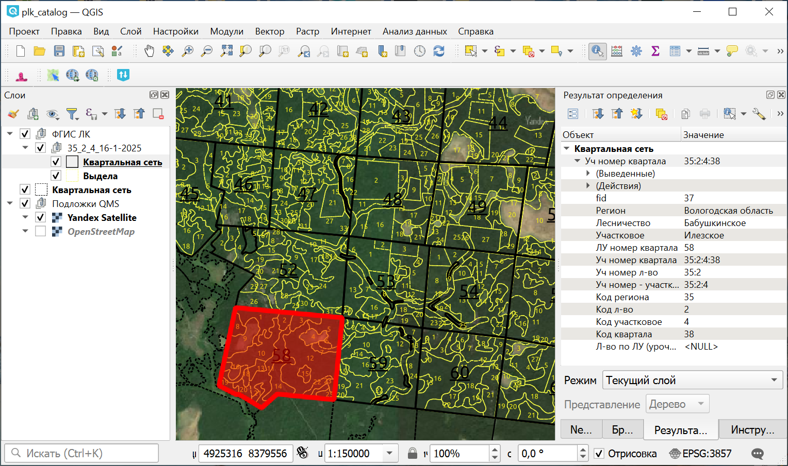

Каталог учетных номеров
========================

Преобразует результаты поиска сервиса Публичной лесной карты в табличный вид.

Позволяет сохранить представляемую сервисом Публичной лесной карты (ПЛК) информацию об учетных номерах кварталов и выделов в границах участкового лесничества в виде геоданных и таблиц.

   Результат работы инструмента на карте

.. important:: Инструмент не предназначен для массового извлечения данных. Не пытайтесь получить им все участки города или кварталы области. Вся атрибутивная информация источника является публичной и общедоступной. Компания NextGIS не несет ответственности за состав данных источника.

На входе:

* Учетный номер - Учетный номер участкового лесничества, например 43:31:7;

На выходе:

* Файл CSV. 
* Файл GPKG - границы кварталов и выделов.

Таблица в формате CSV содержит названия, учетные номера и номера по лесоустройству следующих атрибутов выделов - регион, лесничество, участковое лесничество, урочище, квартал, выдел. Если данные о выделах на сервисе ПЛК отсутствуют - на выходе таблица только с учетными номерами кварталов.

Файл GeoPackage содержит границы кварталов указанного участкового лесничества со всей иерархией номеров в таблице атрибутов - слой kv, а так же границы смежных кварталов без указания урочища - слой _kv (с префиксом). В случае если в источнике есть данные о выделах - в выходной файл также записываются аналогичным с кварталами образом слои v и _v соответственно.

Источник данных: `ФГИС ЛК модуль "Публичная лесная карта" <https://pub.fgislk.gov.ru/map/>`_.

Запуск инструмента: https://toolbox.nextgis.com/t/plk_catalog

**Попробуйте инструмент в действии, скачав наш пример:**

`Набор исходных данных <https://nextgis.ru/data/toolbox/plk_catalog/plk_catalog_inputs_ru.zip>`_ для проверки работы инструмента. Внутри архива пошаговая инструкция.

`Пример результата <https://nextgis.ru/data/toolbox/plk_catalog/plk_catalog_outputs_ru.zip>`_ работы инструмента в формате DB (SQLite).

