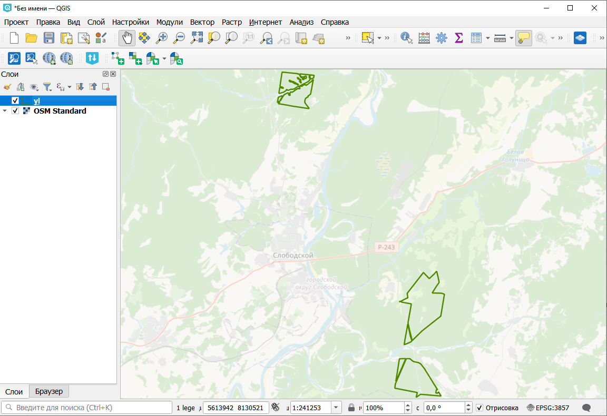

Каталог лесничеств
==================

Получение расположения лесничеств, участковых лесничеств по учетному номеру.

На входе:

* Учетный номер соответствующего уровня, например 43:31 - для лесничества либо 43:31:7 - для участкового лесничества;
* Выбор источника. Выберите из списка, доступно два варианта. По умолчанию выбран вариант А, если не загружается или загружается с ошибкой, попробуйте вариант Б;
* Исправить геометрию - инструмент попытаться исправить ошибки геометрии (для последующей геообработки).

На выходе:

* Границы лесничества в формате GeoPackage;
* Отчёт о работе инструмента - список загруженных объектов в формате "участковое лесничество, лесничество, субъект".

Запуск инструмента: https://toolbox.nextgis.com/t/plk_lesnich

Пример работы инструмента:

   Пример результата работы инструмента. Участковое лесничество Слободское, лесничество Слободское, Кировская область

**Попробуйте инструмент в действии:**

1. Нажмите кнопку **Демо** над формой инструмента. Поля будут автоматически заполнены демонстрационными значениями.
2. Нажмите кнопку **Запустить**.

.. seealso::

   * `Каталог учетных номеров <https://toolbox.nextgis.com/t/plk_catalog?from-related-tools=1>`_
   * `XML в геоданные: Выписки ГЛР <https://toolbox.nextgis.com/t/import_glr?from-related-tools=1>`_
   * `Конвертация данных ЕГРН <https://toolbox.nextgis.com/t/import_egrn?from-related-tools=1>`_
   * `Геометрия участка по кадастровому номеру <https://toolbox.nextgis.com/t/rosreestr2coord?from-related-tools=1>`_