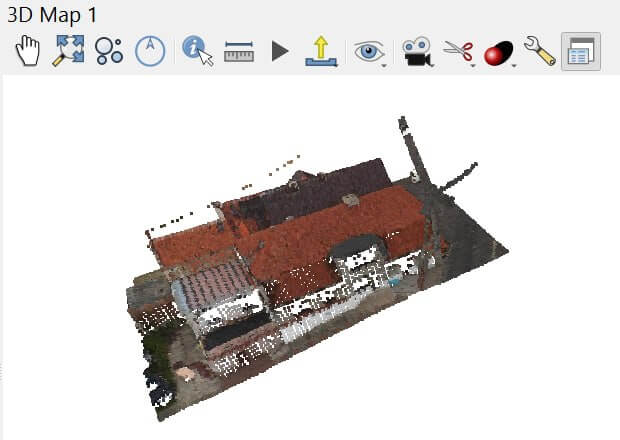

Облако точек в COPC
===================

Конвертирует файлы облаков точек в Cloud Optimized Point Cloud (COPC).

COPC позволяет запрашивать и скачивать только ту часть облака точек, которая нужна в данный момент, без предварительной загрузки всего файла.

На входе:

* Исходное облако точек в формате, поддерживаемом PDAL (LAS, LAZ, PLY, PCD, PTS, PTX, BPF);
* Исходная система координат - если в исходном файле нет данных об СК, введите код EPSG. Например, ``EPSG:4326``;
* Результирующая система координат - если нужно перепроецировать результат, введите код EPSG. Например, ``EPSG:4326``;
* Точность координат - например, ``0.01``. Оставьте пустым, чтобы использовать автоматический вариант;
* Атрибуты:

  - Все (all) - сохранить все атрибуты;
  - Стандарт (standard) - использовать стандартный набор атрибутов COPC.

На выходе:

* Cloud Optimized Point Cloud в формате LAZ.

Запуск инструмента: https://toolbox.nextgis.com/t/point_cloud_to_copc

Пример работы инструмента:

   Пример облака точек

**Попробуйте инструмент в действии:**

1. Нажмите кнопку **Демо** над формой инструмента. Поля будут автоматически заполнены демонстрационными значениями.
2. Нажмите кнопку **Запустить**.

.. seealso::

   * `Конвертация облака точек в тайлсет <https://toolbox.nextgis.com/t/pointcloud2tileset?from-related-tools=1>`_