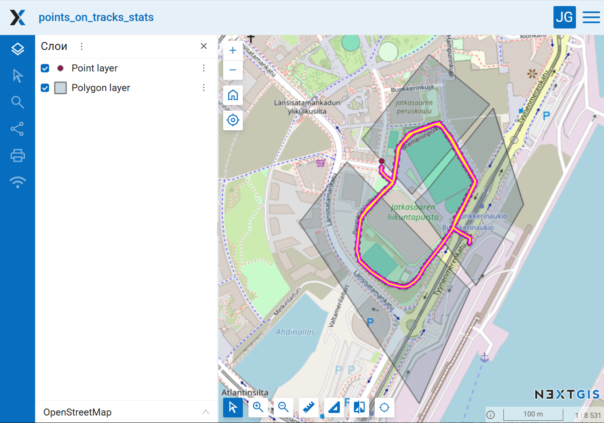

Статистика по точкам и трекам в полигонах из NGW
=======================================================

Подсчет количества точек на километр треков внутри полигонов, все данные берутся из NextGIS Web

На входе:

* Адрес Веб ГИС. Адрес Веб ГИС на портале NextGIS Web. Ссылка вида https://sandbox.nextgis.com;
* Логин. NextGIS ID или имя пользователя Веб ГИС;
* Пароль. Пароль пользователя Веб ГИС;
* ID ресурса с полигонами. Цифры в конце URL ресурса векторного слоя, содержащего полигоны;
* Поле с именами полигонов. Название поля с именем или названием объектов в слое полигонов. Имена полигонов (например, названия областей или номера ячеек сетки) будут использоваться в отчёте;
* ID ресурса с точками. Цифры в конце URL ресурса векторного слоя, содержащего точки;
* Поля с категориями точек. Можно указать несколько атрибутов через запятую, например так: ``author,species``. Оставьте поле пустым, если вам не нужно использовать категории точек для расчётов;
* Поле с датой точек. Имя поля, в котором хранится дата регистрации точки. Оставьте пустым, если вам не нужно фильтровать точки по датам;
* Начальная дата. Начальная дата для фильтрации треков и точек (ГГГГ-ММ-ДД). Если оставить поле пустым, будут использоваться треки с первого доступного дня;
* Конечная дата. Конечная дата для фильтрации треков и точек (ГГГГ-ММ-ДД). Если оставить поле пустым, будут использоваться треки по сегодняшний день;
* Список трекеров. Список трекеров, данные с которых нужно обработать. Записываются ID трекеров через запятую, например ``314,318,340``. Оставьте пустым, чтобы использовать все доступные трекеры;
* Разбивать статистику по трекерам. Использовать идентификатор трекера как ещё одну категорию для расчета статистики;
* Игнорировать полигоны без треков. Не включать в отчёт ситуации, когда точки в полигоне есть, но нет треков.

На выходе:

* CSV файл с отчётом.

ID ресурсов и трекеров можно получить через веб-интерфейс используемой Веб ГИС. Откройте ресурс векторного слоя или трекера, его адрес в браузере будет иметь вид https://demo.nextgis.ru/resource/6895. ID это число в правой части адреса, в данном случае 6895.

Логика работы инструмента:

1. Загрузка векторных слоёв с полигонами и точками из Веб ГИС;
2. Загрузка данных всех (или указанных) трекеров из Веб ГИС;
3. Расчёт длин треков в каждом полигоне, с разбиением по отдельным трекерам или без него, в зависимости от параметров запуска;
4. Расчёт количества точек в каждом полигоне, с разбиением по категориям из атрибутов или без него, в зависимости от параметров запуска;
5. Подсчёт статистики по количеству точек на 1 км треков в каждой ячейке, с учётом всех предыдущих разбиений - по отдельным трекерам или по всем, по всем точкам или с разбиением по категориям;
6. Формирование отчёта.

Запуск инструмента: https://toolbox.nextgis.com/t/points_on_tracks_stats

Пример работы инструмента:

   Пример исходных данных

.. figure:: _static/points_on_tracks_stats_result.png
   :name: points_on_tracks_stats_result_pic
   :align: center
   :width: 16cm

   Пример результата работы инструмента

**Попробуйте инструмент в действии, скачав наш пример:**

`Набор исходных данных <https://nextgis.ru/data/toolbox/points_on_tracks_stats/points_on_tracks_stats_inputs_ru.zip>`_ для проверки работы инструмента. Внутри архива пошаговая инструкция.

`Пример результата <https://nextgis.ru/data/toolbox/points_on_tracks_stats/points_on_tracks_stats_outputs_ru.zip>`_ работы инструмента.
   
.. seealso::

   * `Ведомость ЗМУ <https://toolbox.nextgis.com/t/zmu_data_analysis>`_
   * `Разрезать GPX трек по дням <https://toolbox.nextgis.com/t/gpxdailysplit>`_
   * `Объединение GPX файлов <https://toolbox.nextgis.com/t/gpxmerge>`_
   * `Обрезать GPX файл по прямоугольнику <https://toolbox.nextgis.com/t/gpxclipbbox>`_