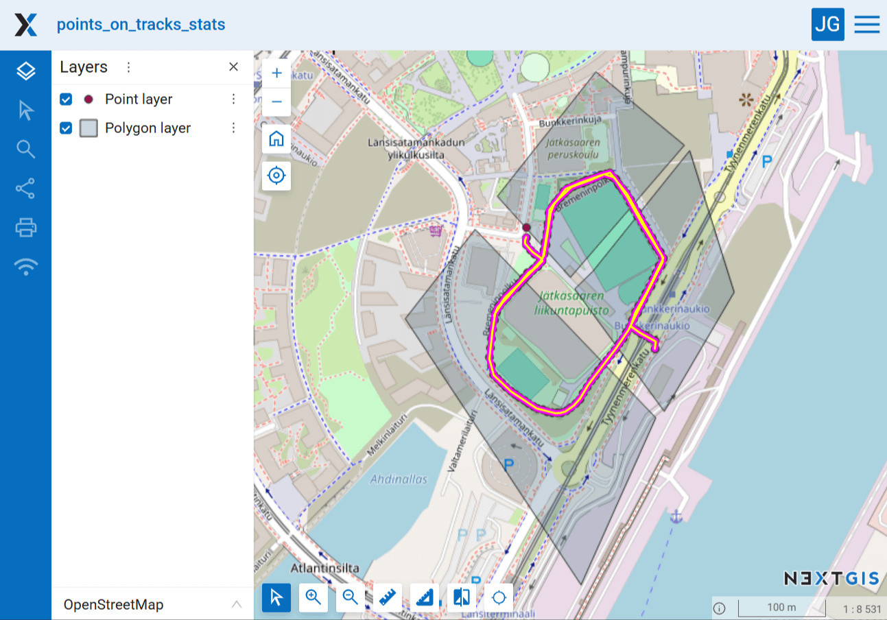
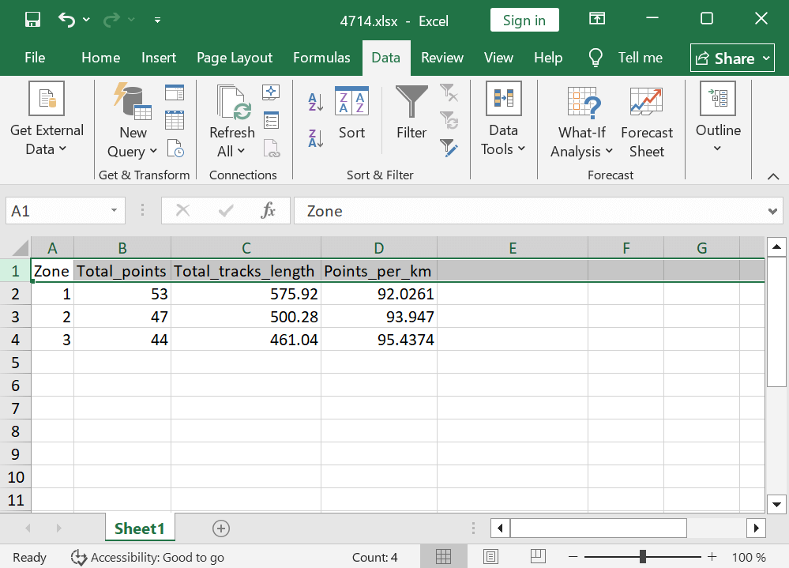

Statistics of points and tracks in polygons from NGW
====================================================

Calculating the number of points per kilometer of tracks inside polygons, all data from NextGIS Web

Inputs:

* Web GIS address. NextGIS Web URL. Example: https://sandbox.nextgis.com;
* Login. NextGIS ID or Web GIS user login;
* Password. Web GIS user password;
* Polygons resource ID. Numbers at the end of the UR of the vector layer that contains polygons
* Polygons layer name field. Field in the polygon layer that contains feature names (for example, area names or grid cell numbers) that will be used in the report;
* Points resource ID. Numbers at the end of the link to the vector layer that contains points;
* Fields with point categories. You can specify multiple attributes separated by commas, for example: ``author,species``. Leave the input blank if you do not need to use point categories for calculations;
* Field with point date. The name of the field that stores the date the point was registered. Leave blank if you do not need to filter points by date;
* Start date. Start date for filtering tracks and points (YYYY-MM-DD). Leave empty to use tracks from first day of database;
* End date. End date for filtering tracks and points (YYYY-MM-DD). Leave empty to use all tracks up to today;
* Trackers list. List of trackers whose data needs to be processed. Tracker IDs are written in comma-separated format, for example ``314,318,340``. Leave blank to use all available trackers;
* Split statistics by trackers. Use tracker ID as another category for calculating statistics;
* Ignore polygons without tracks. Do not include statistics when there are points in polygon, but no tracks.

Output:

* CSV file with report.

The ID of resources and trackers can be obtained through the web interface of the Web GIS used. Open the resource of the vector layer or tracker, its address in the browser will look like https://demo.nextgis.com/resource/6895. ID is the number on the right side of the address, in this case 6895.

Tool workflow:

1. Load vector layers with polygons and points from Web GIS;
2. Load data from all (or specified) trackers from Web GIS;
3. Calculate track lengths in each polygon, with or without division by individual trackers, depending on the launch parameters;
4. Calculate the number of points in each polygon, with or without division by categories from attributes, depending on the launch parameters;
5. Calculate statistics on the number of points per 1 km of tracks in each polygon, taking into account all previous divisions - by individual trackers or by all, by all points or with division by categories;
6. Generate a report.

Launch the tool: https://toolbox.nextgis.com/t/points_on_tracks_stats

Example:

   Example input

   Example output

**Try it out using our sample:**

Download `input dataset <https://nextgis.com/data/toolbox/points_on_tracks_stats/points_on_tracks_stats_inputs.zip>`_ to test the instrument. Step-by-step instructions included.

Get the `output <https://nextgis.com/data/toolbox/points_on_tracks_stats/points_on_tracks_stats_outputs.zip>`_ to additionally check the results.
   
.. admonition:: Related tools

   * `Split GPX file by days <https://toolbox.nextgis.com/t/gpxdailysplit?from-related-tools=1>`_
   * `Merge GPX files <https://toolbox.nextgis.com/t/gpxmerge?from-related-tools=1>`_
   * `Clip GPX file by bounding box <https://toolbox.nextgis.com/t/gpxclipbbox?from-related-tools=1>`_