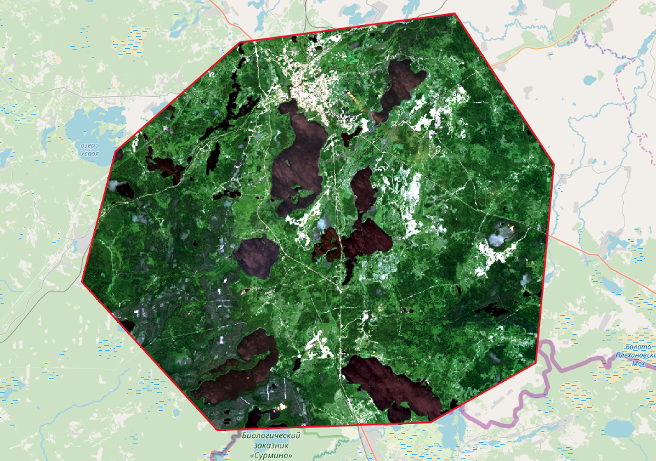

Подготовить растр
=================

Осуществляет поканальную склейку набора одноканальных растров и обрезку склеенного растра по векторной маске.

На входе:

* Исходные растровые данные. Исходные данные могут быть представлены в двух видах, 1) многоканальный растр в GDAL-совместимом формате, 2) ZIP архив с набором одноканальных GDAL-совместимых растров.
* Исходные векторные данные. Исходные векторные данные могут быть представлены в двух видах, 1) отдельный файл, поддерживаемый OGR, 2) ZIP архив с ESRI Shapefile. Векторные данные будут использованы для обрезки исходного растра.
* Значение Nodata. Опционально. Значение, которое будет помечено как Nodata. По умолчанию 0.
* Название выходного растра. Опционально. Без расширения файла. Расширение будет автоматически установлено в .tif.

На выходе:

* Результирующий растр в формате TIFF.

Если на входе архив с одноканальными растрами, инструмент сначала объединяет их в многоканальный растр. Порядок каналов определяется алфавитной сортировкой имён исходных растров в архиве.
Затем многоканальный растр (собранный из архива или поданный на вход сразу) обрезается по векторной маске.

Исходные растры и векторная маска могут быть в разных системах координат, перед началом обработки все данные приводятся в единый пространственный домен.

Запуск инструмента: https://toolbox.nextgis.com/t/prepare_raster

   Пример результата работы инструмента

**Попробуйте инструмент в действии**

1. Нажмите кнопку **Демо** над формой инструмента. Поля будут автоматически заполнены демонстрационными значениями.
2. Нажмите кнопку **Запустить**.

.. seealso::

   * `Калькулятор растров (GRASS) <https://toolbox.nextgis.com/t/r_mapcalc?from-related-tools=1>`_
   * `Калькулятор растров (GDAL) <https://toolbox.nextgis.com/t/raster_calculator?from-related-tools=1>`_
   * `Подготовка и скачивание данных Sentinel-2 <https://toolbox.nextgis.com/t/download_and_prepare_l8_s2?from-related-tools=1>`_
   * `Cцены Sentinel-2 в GPKG <https://toolbox.nextgis.com/t/s2_search?from-related-tools=1>`_