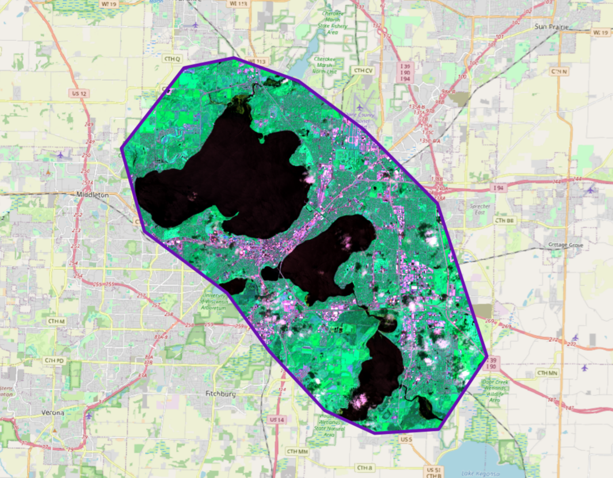

Prepare raster
==============

A tool that performs a per-band connection of a set of single-band rasters and crops the result using a vector mask.

Inputs:

* Input raster dataset. 1) multiband GDAL-supported raster or 2) ZIP archive with singleband GDAL-supported rasters;
* Input vector dataset. It will be used for clipping input raster. 1) OGR-supported single file or 2) ZIP archive with ESRI Shapefile. 
* Nodata value. Optional. Value that will be set as Nodata. Default is 0.
* Output dataset name. Optional. No extension (e.g. ndvi, water). Extension will be automatically set to .tif.

Outputs:

* Result raster in TIFF format.

   Example output

If the input is an archive with single-band rasters, the tool first combines them into a multi-band raster. The order of the bands is determined by alphabetically sorting the names of the initial rasters in the archive. 
Then the multi-band raster (assembled from the archive or submitted immediately) is cropped with a vector mask.

The initial rasters and the vector mask can be in different coordinate systems before processing, all data is brought into a single spatial domain.

Launch the tool: https://toolbox.nextgis.com/t/prepare_raster

**Try the tool in action**

1. Click on the **Demo** button above the tool form. The fields are filled in with demo values.
2. Click on the **Run** button.

.. admonition:: Related tools

  * `Raster calculator (GRASS) <https://toolbox.nextgis.com/t/r_mapcalc?from-related-tools=1>`_
  * `Raster calculator (GDAL) <https://toolbox.nextgis.com/t/raster_calculator?from-related-tools=1>`_
  * `Prepare and download Sentinel-2 data <https://toolbox.nextgis.com/t/download_and_prepare_l8_s2?from-related-tools=1>`_
  * `Search and save Sentinel-2 scene previews <https://toolbox.nextgis.com/t/s2_search?from-related-tools=1>`_