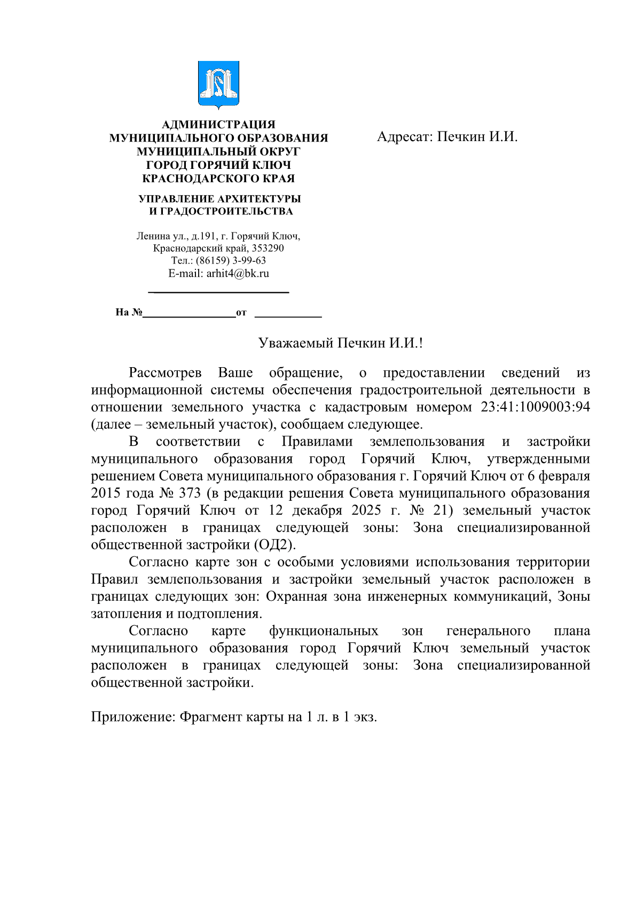
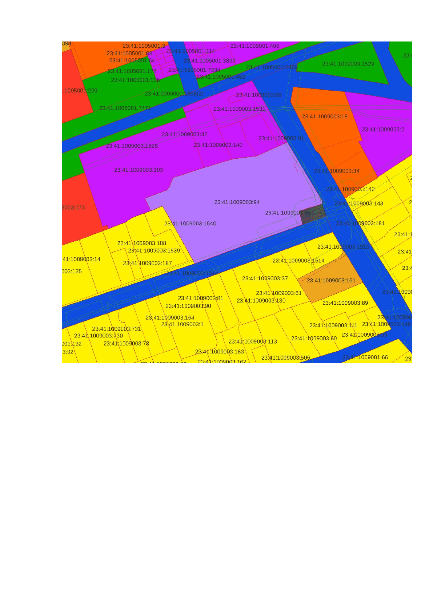

Отчет по ПЗЗ по участку
=======================

Отчет по Правилам землепользования и застройки, территориальным зонам, ЗОУИТ по кадастровому участку. Инструмент работает в демо-режиме и принимает кадастровые участки только по г. Горячий ключ (Краснодарский край).

На входе:

* Номер земельного участка. Введите кадастровый номер. Например: 23:41:1009003:94
* Кому - имя человека, которому должен быть адресован документ. Например: Печкин И.И.

На выходе:

* DOCX c ответом на обращение по шаблону.

Запуск инструмента: https://toolbox.nextgis.com/t/pzz_report

Пример результата работы инструмента:

   Первая страница: ответ на обращение

   Вторая страница: фрагмент карты

**Попробуйте инструмент в действии, скачав наш пример:**

1. Нажмите кнопку **Демо** над формой инструмента. Поля будут автоматически заполнены демонстрационными значениями.
2. Нажмите кнопку **Запустить**.

