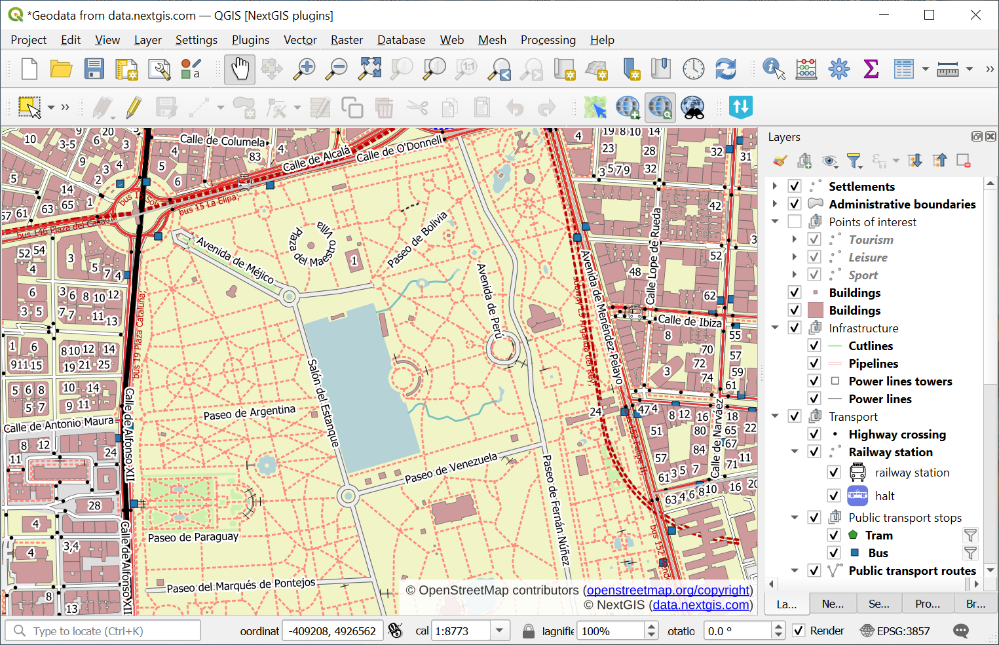

QGIS project to PDF
================================

Output the whole map and each separate map layer as PDF.

Inputs:

* The QGIS project and data. Archive of the QGIS project with all layers zipped.
* Extent. Optional parameter. If left blank, the coverage will be calculated as the sum of the coverage of the project layers;
* The width of the output PDF file, mm;
* The height of the output PDF file, mm.

Outputs:

* ZIP archive with PDF files.

Launch the tool: https://toolbox.nextgis.com/t/qgis2pdf

   Example input

.. figure:: _static/qgis2pdf_result.png
   :name: qgis2pdf_result_pic
   :align: center
   :width: 16cm

   Example output image

**Try the tool in action**

1. Click on the **Demo** button above the tool form. The fields are filled in with demo values.
2. Click on the **Run** button.

.. admonition:: Related tools

   * `Vertical map for Social Media <https://toolbox.nextgis.com/t/mappy?from-related-tools=1>`_
