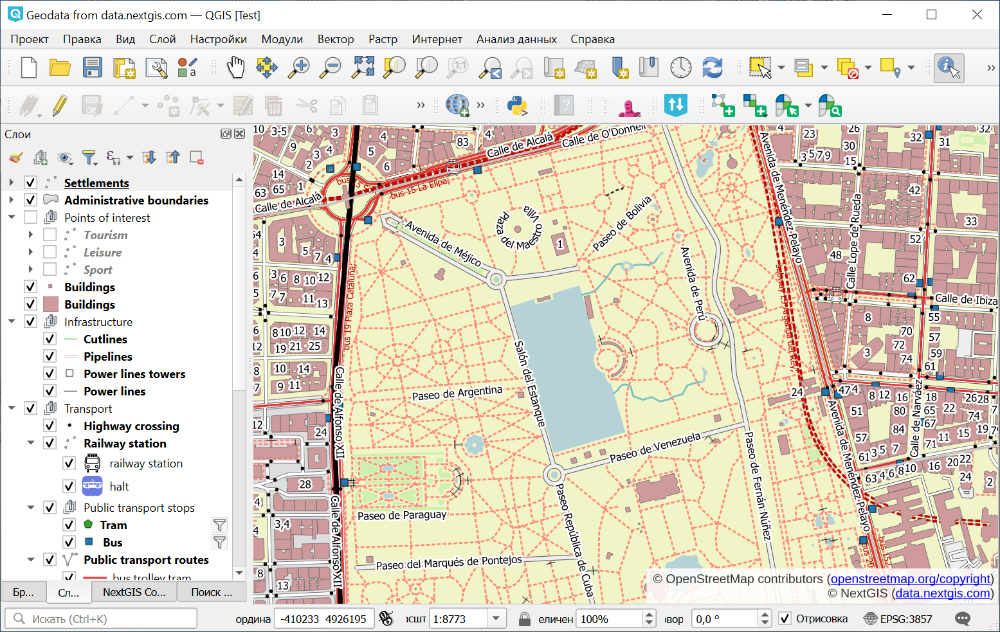
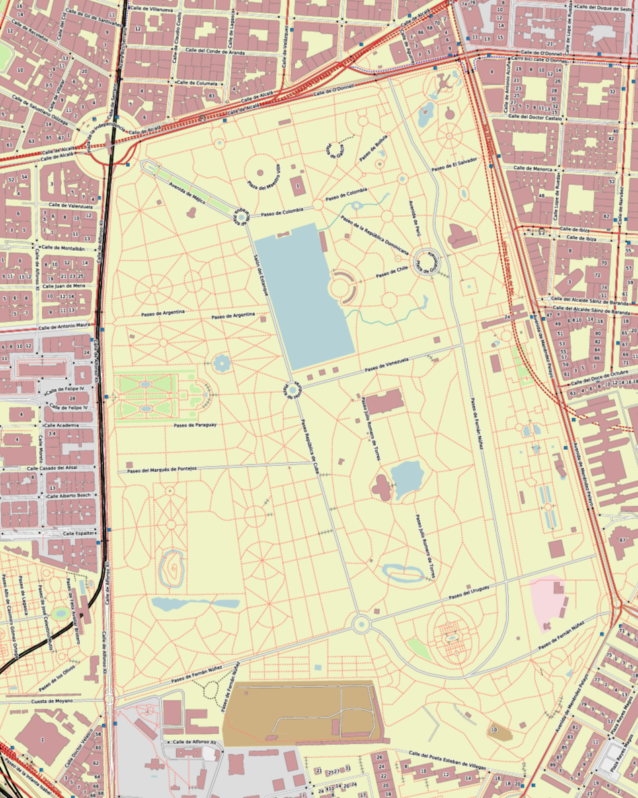

Проект QGIS в PDF
==============================

Создает печатную версию карты целиком и набор отдельных слоёв карты в PDF.

На входе:

* Проект QGIS с данными. Архив ZIP с проектом QGIS и всеми слоями;
* Охват. Опциональный параметр. Если оставить пустым, охват будет рассчитан как сумма охватов слоёв проекта;
* Ширина файла PDF, mm.
* Высота файла PDF, мм.

На выходе:

* ZIP-архив с PDF.

Запуск инструмента: https://toolbox.nextgis.com/t/qgis2pdf

   Пример исходных данных

   Пример полученного изображения

**Попробуйте инструмент в действии**

1. Нажмите кнопку **Демо** над формой инструмента. Поля будут автоматически заполнены демонстрационными значениями.
2. Нажмите кнопку **Запустить**.

.. seealso::

   * `Карта для соцсетей <https://toolbox.nextgis.com/t/mappy?from-related-tools=1>`_
