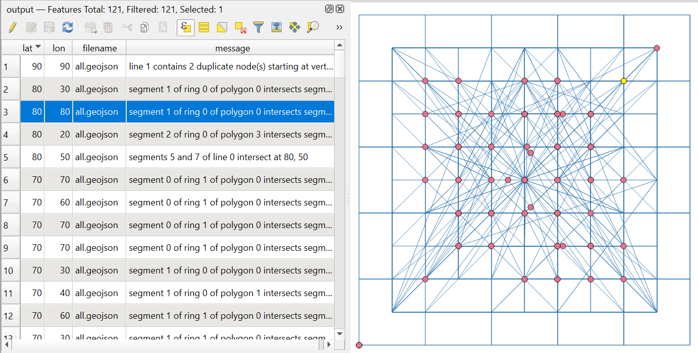

Проверка геометрии (QGIS)
=========================

Проверяет корректность геометрии векторного файла с помощью алгоритма QGIS checkvalidity.

На входе:

* ZIP-архив c векторными файлами. Поддерживаются векторные файлы форматов, состоящих из одного файла (например, Geopackage, GeoJSON и т.д.).

На выходе:

* CSV файл со списком ошибок и координат;
* GeoJSON файл с геометриями месторасположения ошибок.

.. note:: QGIS не даёт информации по некоторым ошибкам, и в качестве координат ставит нули. В таком случае инструмент формирует записи в GeoJSON без координат, но с обозначением ошибки.

Запуск инструмента: https://toolbox.nextgis.com/t/qgis_check_geometries

Пример работы инструмента:

   Пример работы инструмента. Точки отмечают ошибки геометрии

**Попробуйте инструмент в действии, скачав наш пример:**

`Набор исходных данных <https://nextgis.ru/data/toolbox/qgis_check_geometries/qgis_check_geometries_inputs_ru.zip>`_ для проверки работы инструмента. Внутри архива пошаговая инструкция.

`Пример результата <https://nextgis.ru/data/toolbox/qgis_check_geometries/qgis_check_geometries_outputs_ru.zip>`_ работы инструмента.

.. seealso::

   * `Исправление геометрий (QGIS) <https://toolbox.nextgis.com/t/qgis_fix_geometries>`_
   * `Исправление геометрий <https://toolbox.nextgis.com/t/fix_geometries>`_