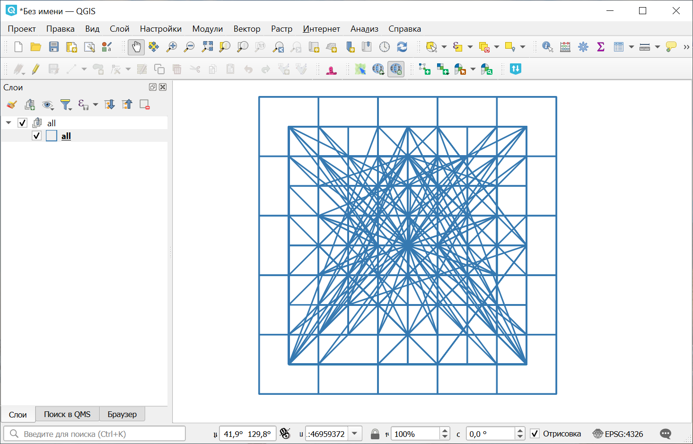
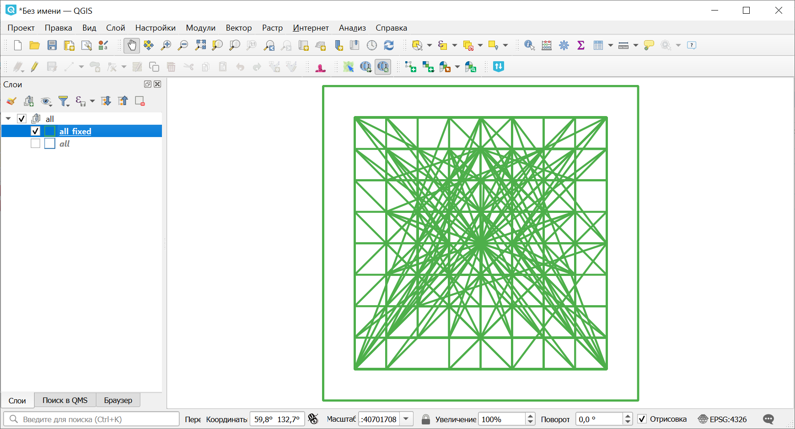

Исправление геометрий (QGIS)
============================

Исправление некорректных геометрий в векторных файлах с помощью алгоритма qgis:fixgeometries.

На входе:

* ZIP-архив c векторными файлами. Поддерживаются векторные файлы форматов, состоящих из одного файла (например, GeoPackage, GeoJSON и т.д.);
* Метод. Метод алгоритма qgis:fixgeometries. Выберите из списка: 
    - Linework
    - Structure.

На выходе:

* ZIP-архив, содержащий векторные файлы с корректной геометрией.

Запуск инструмента: https://toolbox.nextgis.com/t/qgis_fix_geometries

Пример работы инструмента:

   Исходные данные

   Исправленные геометрии

**Попробуйте инструмент в действии, скачав наш пример:**

`Набор исходных данных <https://nextgis.ru/data/toolbox/qgis_fix_geometries/qgis_fix_geometries_inputs_ru.zip>`_ для проверки работы инструмента. Внутри архива пошаговая инструкция.

`Пример результата <https://nextgis.ru/data/toolbox/qgis_fix_geometries/qgis_fix_geometries_outputs_ru.zip>`_ работы инструмента.

.. seealso::

   * `Проверка геометрии <https://toolbox.nextgis.com/t/check_geometries?from-related-tools=1>`_
   * `Проверка геометрии (QGIS) <https://toolbox.nextgis.com/t/qgis_check_geometries?from-related-tools=1>`_
