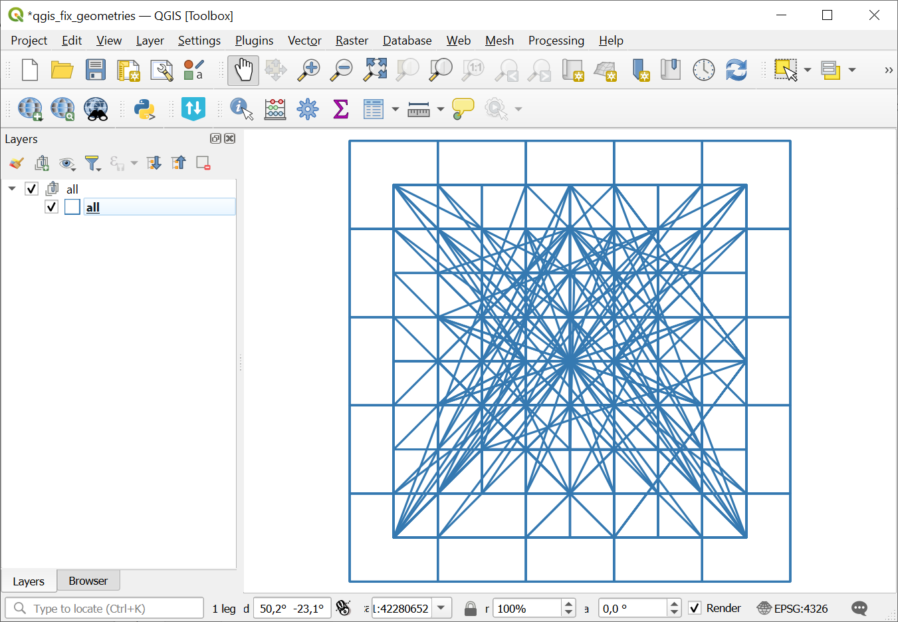
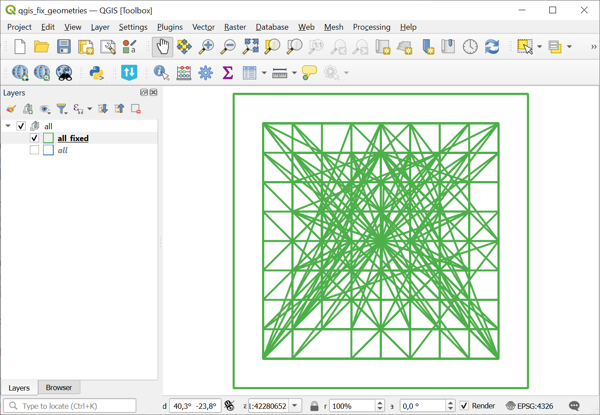

Fix geometries (QGIS)
=====================

Correction of incorrect geometries in vector files using the qgis:fixgeometries algorithm.

Inputs:

* ZIP archive with vector files. Only single-file formats are supported (GeoPackage, GeoJSON, etc. **not** ESRI Shapefile);
* Method. The method of the qgis algorithm 'fixgeometries'. Choose one from the list: Linework or Structure.

Outputs:

* ZIP archive containing vector files with correct geometry.

Launch the tool: https://toolbox.nextgis.com/t/qgis_fix_geometries

Example:

   Example input

   Fixed geometries

**Try the tool in action**

1. Click on the **Demo** button above the tool form. The fields are filled in with demo values.
2. Click on the **Run** button.

.. admonition:: Related tools

  * `Check geometries <https://toolbox.nextgis.com/t/check_geometries?from-related-tools=1>`_
  * `Check geometries (QGIS) <https://toolbox.nextgis.com/t/qgis_check_geometries?from-related-tools=1>`_
