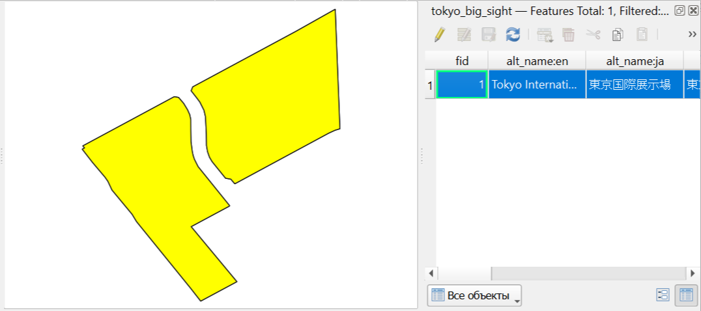
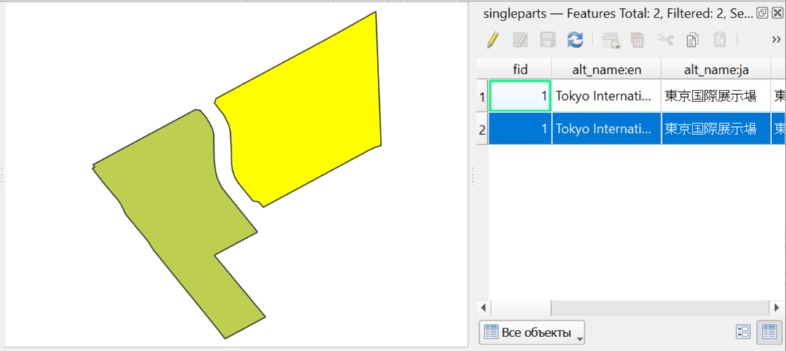

Разбить составную геометрию
===========================

Инструмент преобразует векторный файл с составными (мульти-) геометриями в файл, в котором все геометрии содержат только одну часть. Объекты с составными геометриями разделяются на столько отдельных объектов, сколько частей содержит исходная геометрия, и для каждого из них используются те же самые атрибуты.

Это полезно, когда вам нужно работать с отдельными частями геометрии по отдельности или когда вам нужно убедиться, что все объекты имеют однокомпонентные геометрии для совместимости с определенными алгоритмами обработки или форматами данных.

На входе:

* Исходные данные - любой векторный файл, который может содержать составные геометрии (такие как MultiPolygon, MultiLineString или MultiPoint).

На выходе:

* Новый векторный файл GeoJSON, где каждый объект содержит только однокомпонентную геометрию. Выходной файл будет иметь те же поля атрибутов, что и входной, но потенциально больше объектов, если входной файл содержал составные геометрии.

Запуск инструмента: https://toolbox.nextgis.com/t/qgis_multiparttosingleparts

   Пример объекта с составной полигональной геометрией до обработки

   Тот же объект после преобразования в простые геометрии - каждая часть становится отдельным объектом с идентичными атрибутами

**Попробуйте инструмент в действии, скачав наш пример:**

`Набор исходных данных <https://nextgis.ru/data/toolbox/qgis_multiparttosingleparts/qgis_multiparttosingleparts_inputs_ru.zip>`_ для проверки работы инструмента. Внутри архива пошаговая инструкция.

`Пример результата <https://nextgis.ru/data/toolbox/qgis_multiparttosingleparts/qgis_multiparttosingleparts_outputs_ru.zip>`_ работы инструмента.

.. seealso::

   * `Удалить ZM координаты из векторного слоя <https://toolbox.nextgis.com/t/flatten>`_