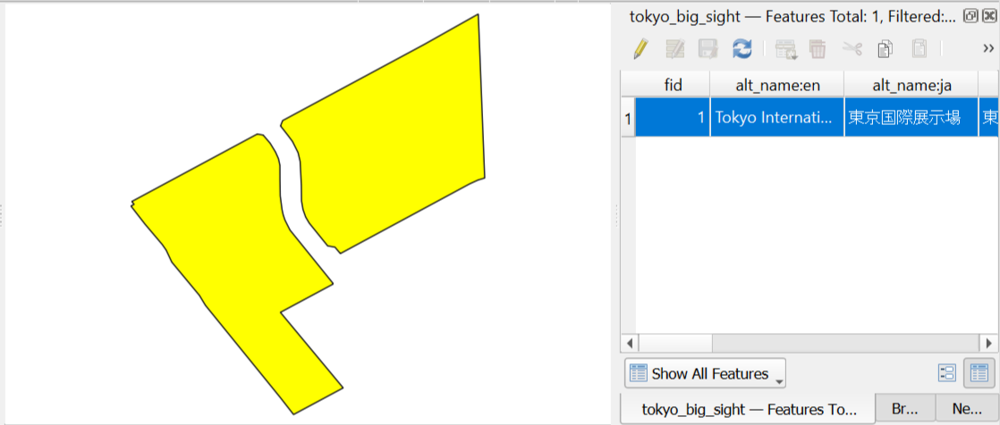
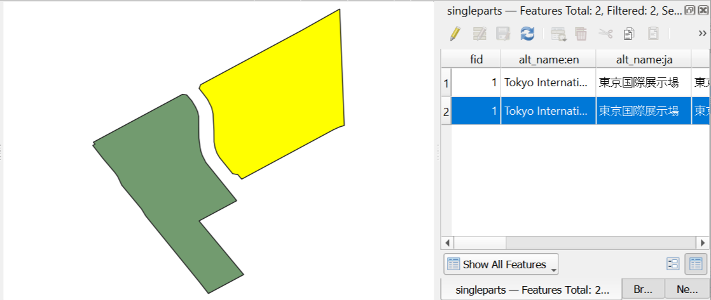

Multipart to singleparts
========================

This tool takes a vector file with multipart geometries and generates a new one in which all geometries contain a single part. Features with multipart geometries are divided into as many different features as parts the geometry contains, and the same attributes are used for each of them.

This is useful when you need to work with individual geometry parts separately, or when you need to ensure that all features have single-part geometries for compatibility with certain processing algorithms or data formats.

Input:

* Vector file - any vector file that may contain multipart geometries (such as MultiPolygon, MultiLineString, or MultiPoint).

Output:

* A new vector GeoJSON file where each feature contains only a single-part geometry. The output will have the same attribute fields as the input, but potentially more features if the input contained multipart geometries.

Launch the tool: https://toolbox.nextgis.com/t/qgis_multiparttosingleparts

   Example of a multipart polygon feature before processing

   The same feature after conversion to singleparts - each part becomes a separate feature with identical attributes

**Try it out using our sample:**

Download `input dataset <https://nextgis.com/data/toolbox/qgis_multiparttosingleparts/qgis_multiparttosingleparts_inputs.zip>`_ to test the instrument. Step-by-step instructions included.

Get the `output <https://nextgis.com/data/toolbox/qgis_multiparttosingleparts/qgis_multiparttosingleparts_outputs.zip>`_ to additionally check the results.