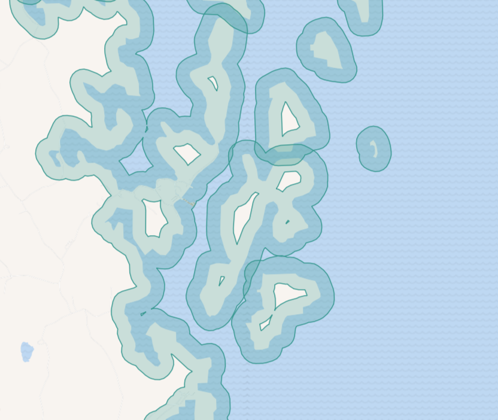

Растровые тайлы из проекта QGIS
==========================================

Из архива с проектом QGIS и данными генерирует архив с растровыми тайлами. Используются все настройки стилей QGIS.

На входе:

* Архив с проектом и данными - ZIP-архив, содержащий проект QGIS и данные;
* Охват - Если охват пустой, то будет использован охват всех слоёв в проекте. Но он может неожиданно для вас охватить всю планету, тогда работа инструмента займёт очень много времени. Можно задать охват несколькими способами: 1) загрузить полигоны в виде **файла** - этот способ подойдёт, если нужны тайлы на территорию сложной формы, например, вдоль береговой линии, 2) нарисовать на карте, 3) нарисовать и подкорректировать полученные значения или 4) ввести вручную в формате xmin, xmax, ymin, ymax в системе координат WGS 84 (EPSG:4326), например ``-7.3,42.1,10.5,50.5``;
* Минимальный уровень зума - от 0 до 25, по умолчанию 0;
* Максимальный уровень зума - от 0 до 25, по умолчанию 9;
* Формат изображений - По умолчанию PNG. Также можно ввести ``JPG``;
* Цвет фона -  RGBA, четыре числа, разделённые запятой, последнее - прозрачность, по умолчанию 0,0,0,0 (прозрачный);
* DPI - разрешение изображения, в пикселях на дюйм, от 48 до 600, по умолчанию 96;
* Размер метатайла - от 1 до 20, по умолчанию 4;
* Качество для формата JPEG - определяет уровень сжатия изображения, от 1 (сильное сжатие) до 100 (максимальное качество), по умолчанию умеренное сжатие - 75;
* Высота тайла в пикселях, по умолчанию 255;
* Ширина тайла в пикселях, по умолчанию 255.

На выходе:

* ZIP-архив, содержащий папки с тайлами в выбранном формате, сгруппированными по уровням зума.

Запуск инструмента: https://toolbox.nextgis.com/t/qgis_rastertiles

   Пример полигонов со сложной геометрией, использующихся для задания охвата

**Попробуйте инструмент в действии**

1. Нажмите кнопку **Демо** над формой инструмента. Поля будут автоматически заполнены демонстрационными значениями.
2. Нажмите кнопку **Запустить**.

.. seealso::

   * `Векторные тайлы из проекта QGIS <https://toolbox.nextgis.com/t/qgis_vectortiles?from-related-tools=1>`_
   * `Набор тайлов из растра <https://toolbox.nextgis.com/t/raster2tiles?from-related-tools=1>`_
   * `PDF из проекта QGIS <https://toolbox.nextgis.com/t/qgis2pdf?from-related-tools=1>`_