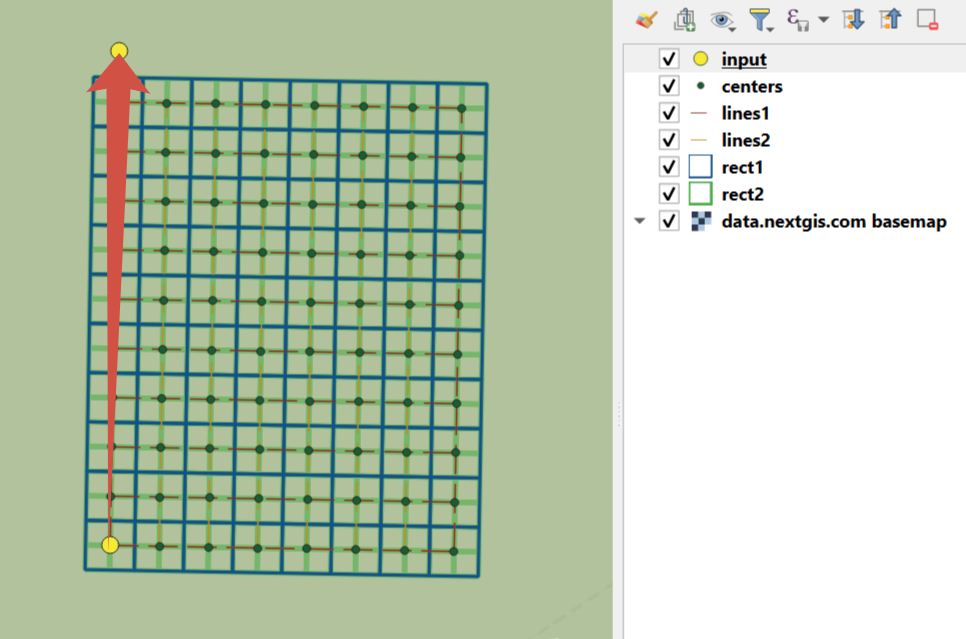

Генератор набора квадратов
==========================

Этот инструмент cоздает набор сеток квадратов (полигоны) и трансект их обхода для заданной территории.

На входе (все поля являются обязательными):

* x0 - Долгота исходной точки (центр первой ячейки)
* y0 - Широта исходной точки
* x1 - Долгота точки 1, задающей направление
* y1 - Широта точки 1, задающей направление
* Сторона отсчета - Выберите, с какой стороны относительно линии между точкой 0 и точкой 1 будет сгенерирована сетка: укажите ``right`` или ``left``
* Размер 1 - Количество ячеек по первой оси
* Размер 2 - Количество ячеек по второй оси
* Размер ячейки - Размер стороны ячейки, в метрах

Результатом работы процесса является набор слоёв:

* rect1 - сеть ячеек, центр первой ячейки - в исходной точке
* rect2 - сеть уменьшенных ячеек (т.е. каждая крупная ячейка разделена на 4 части)
* line1 - линии обхода в направлении, перпендикулярном линии, представленной точкой 0 и точкой 1
* line2 - линии обхода в направлении, параллельном линии, представленной точкой 0 и точкой 1
* centers - центры ячеек сетки rect1

Запуск инструмента: https://toolbox.nextgis.com/operation/quadro

   
   Пример результата работы инструмента. Желтым отмечены точки, поданные на вход, стрелкой - заданное ими направление

**Попробуйте инструмент в действии, скачав наш пример:**

`Набор исходных данных <https://nextgis.ru/data/toolbox/quadro/quadro_inputs_ru.zip>`_ для проверки работы инструмента. Внутри архива пошаговая инструкция.

`Пример результата <https://nextgis.ru/data/toolbox/quadro/quadro_outputs_ru.zip>`_ работы инструмента.
