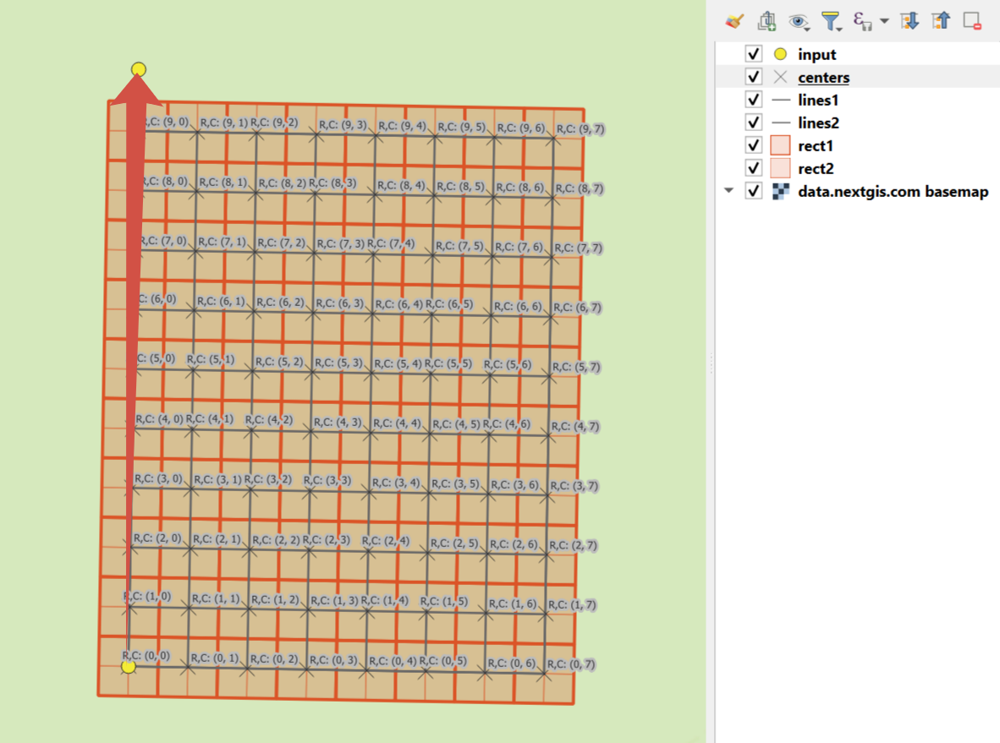

Generate a set of squares with transects
==========================================

This tool creates a set of square grids (polygons) and a transect for the territory.

Inputs:

* Coordinates of the first point (center of the first cell), in decimal degrees, example ``40.415378, -3.688743``;
* Coordinates of the second point that indicates direction, in decimal degrees, example ``40.417436, -3.683170``;
* Size 1 - Number of cells on the first axis;
* Size 2 - Number of cells on the second axis;
* Side - Cell generation side ``right`` or ``left``;
* Cell size - The size of a cell’s side, in meters.

The result of the process is a set of layers:

* rect1 - a grid of cells "Size 1" by "Size 2", the center of the first cell is at the point 1;
* rect2 - a grid of smaller cells (i.e. each large cell is divided into 4 parts);
* line1 - transect lines in the direction perpendicular to the line between points 1 and 2;
* line2 - transect lines in the direction parallel to the line between points 1 and 2;
* centers - cell centers of rect1 grid.

Styles for all the layers are also included as QML files.

Launch tool: https://toolbox.nextgis.com/t/quadro

View the results on an interactive map: https://demo.nextgis.com/resource/4582/display?panel=layers

   
   An example of the results

**Try it out using our sample:**

Download `input dataset <https://nextgis.com/data/toolbox/quadro/quadro_inputs.zip>`_ to test the instrument. Step-by-step instructions included.

Get the `output <https://nextgis.com/data/toolbox/quadro/quadro_outputs.zip>`_ to additionally check the results.
