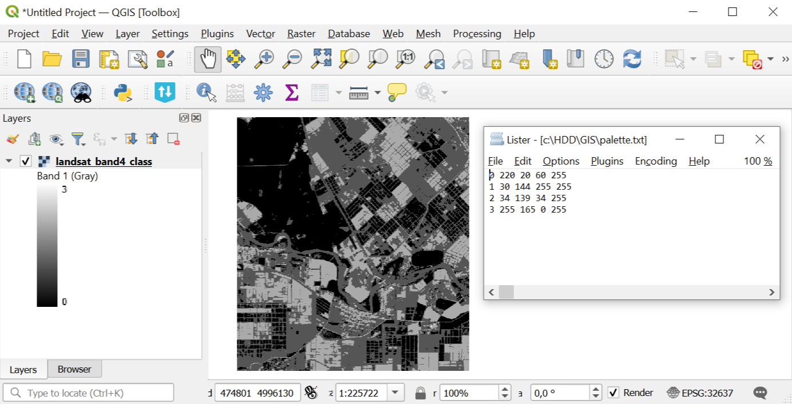
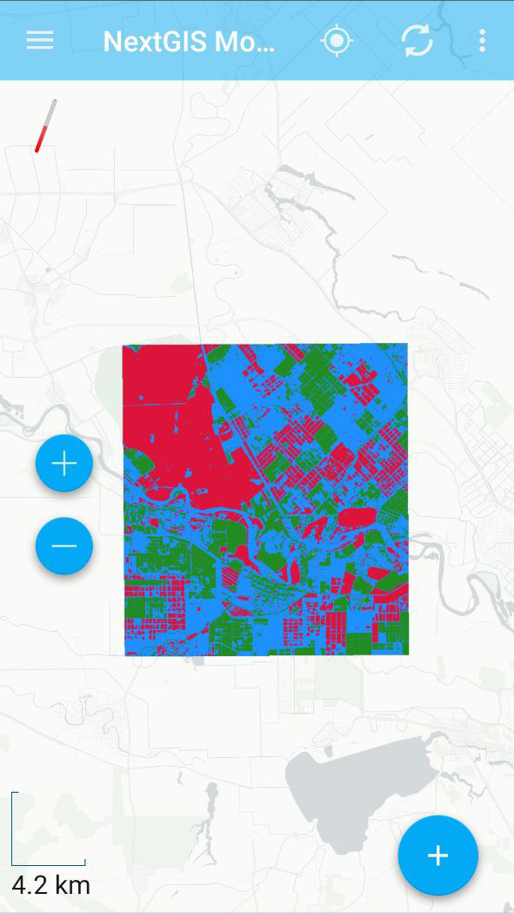

Raster to NGRC
==============

This tool generates NGRC raster tileset from any input GDAL-supported raster. The result can be added to NextGIS Mobile.

Inputs:

*  Raster dataset - RGB, RGBA, single-band gray or single-band with palette GDAL-compatible raster;
*  Palette file - TXT file  with color scheme of each raster values  located in a separate line. Order: *Value Red Green Blue Opacity*. For example, for a value of 23, assigning a completely opaque lilac color looks like this: ``23 200 162 200 255``. Opacity ranges from 0 to 255, 0 - completely transparent, 255 - completely opaque.  Use an empty text file to keep the original palette (for single-band with palette) and for RGB / RGBA rasters;
*  Zoom levels - the levels at which the tiles will be displayed. This refers to `standard zoom levels <https://wiki.openstreetmap.org/wiki/Zoom_levels>`_, for example, as for OSM maps. Possible input values: a number indicating one level, for example, 10; a range of levels, for example, 8-14; hyphen - for auto-selection of levels.

Outputs:

*  NGRC file with tileset.

Launch the tool: https://toolbox.nextgis.com/t/raster2tiles

Example of the tool's work:

   Example input

   Example output

**Try the tool in action**

1. Click on the **Demo** button above the tool form. The fields are filled in with demo values.
2. Click on the **Run** button.

.. admonition:: Related tools

  * `Generate raster tiles from QGIS project <https://toolbox.nextgis.com/t/qgis_rastertiles?from-related-tools=1>`_
  * `Point cloud to tileset <https://toolbox.nextgis.com/t/pointcloud2tileset?from-related-tools=1>`_
  * `Generate vector tiles from QGIS project <https://toolbox.nextgis.com/t/qgis_vectortiles?from-related-tools=1>`_
