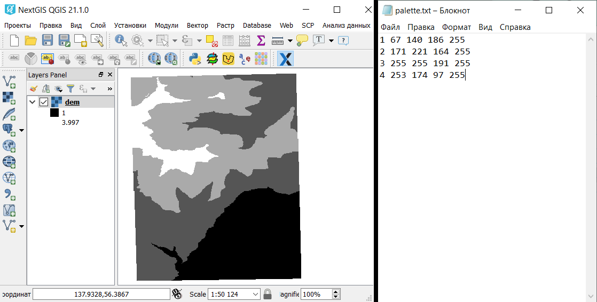
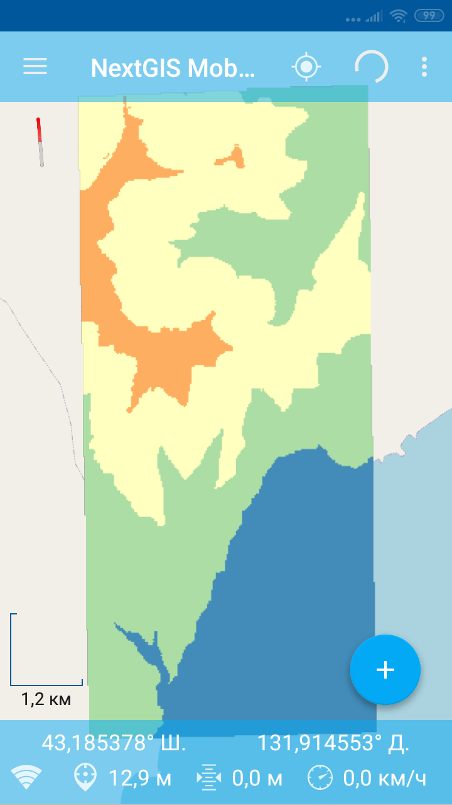

Создание тайлового набора по растру
===================================

Инструмент создает тайлы в формате NGM (.NGRC) на основе GDAL-совместимого набора растровых геоданных.

На входе:

*  Файл с палитрой - текстовый файл (расширение .TXT), в котором описание цвета (формат RGBA) каждого значения растра занимает отдельную строку. Порядок записи: *Значение Красный Зеленый Синий Непрозрачность*. Например, для значения 23 присвоение абсолютно непрозрачного сиреневого цвета выглядит так: ``23 200 162 200 255``. Непрозрачность находится в пределах от 0 до 255, 0 - абсолютно прозрачный, 255 - абсолютно непрозрачный.  Используйте пустой текстовый файл, чтобы составить исходную палитру (для одноканальных растров с палитрой) и для RGB/RGBA растров;
*  Исходный растр - RGB, RGBA, одноканальный серый или одноканальный с палитрой GDAL-совместимый растр;
*  Название тайлового набора - название набора тайлов, которое будет использовано для имени файла и для слоя в NGM;
*  Масштабные уровни - уровни, на которых будут отображаться тайлы. Имеются в виду `стандартные уровни зумирования <https://wiki.openstreetmap.org/wiki/Zoom_levels>`_, например, как для карт OSM. Возможные вносимые значения: число, обозначающее один уровень, например, 10; диапазон уровней, например, 8-14; оставьте пустым для автоподбора уровней.

На выходе:

*  файл NGRC с тайловым набором.

   
   Пример исходных данных
   

   
   Пример результата работы инструмента - файл .NGRC, добавленный в NextGIS Mobile

Запуск инструмента: https://toolbox.nextgis.com/t/raster2tiles

**Попробуйте инструмент в действии**

1. Нажмите кнопку **Демо** над формой инструмента. Поля будут автоматически заполнены демонстрационными значениями.
2. Нажмите кнопку **Запустить**.

.. seealso::

   * `Растровые тайлы из проекта QGIS <https://toolbox.nextgis.com/t/qgis_rastertiles?from-related-tools=1>`_
   * `Конвертация облака точек в тайлсет <https://toolbox.nextgis.com/t/pointcloud2tileset?from-related-tools=1>`_
   * `Векторные тайлы из проекта QGIS <https://toolbox.nextgis.com/t/qgis_vectortiles?from-related-tools=1>`_