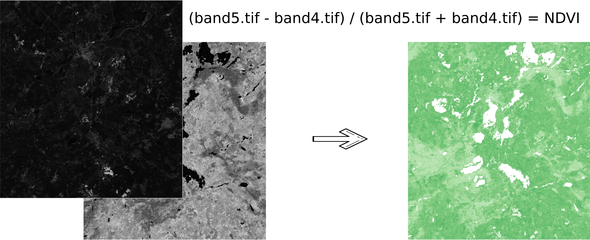

Raster calculator (GDAL)
=========================

   
   
A tool that implements raster arithmetics for multi-band rasters or groups of single-band rasters. Uses `gdal_calc.py <https://gdal.org/programs/gdal_calc.html>`_ script.

Inputs:

* Initial raster data:

1. Multi-band raster in GDAL-compatible format, or

2. ZIP archive with a set of single-bandl GDAL-compatible rasters

Rasters in the archive can be stored in different coordinate systems, have different extents and cell sizes. When calculated, everything will be reduced to a single spatial domain.

* Expression.

Standard expression using the operators ``+, -, \*, /,>, <``, etc. If the initial data is in a ZIP archive, then the names of the source files in the expression should be used (for example, ``band4.tif / band5.tif``, if the files have the corresponding names). The extension is part of the name. 
For a multi-band raster, use the band number with the ``&`` prefix (for example, ``& 4 / & 5``). Bands are numerated starting at 1.

Examples of expressions:

Forest areas with a temperature of less than 30 degrees:

``forest_mask.tif * (land_temperature.tif < 30)``

EVI Index:

``2.5 * (&5 - &4) / (&5 + 6.0*&4 - 7.5*&2 + 1.0)``

* The name of the resulting raster. No file extension (e.g. ndvi, water). The extension will be automatically set to .TIF

* X resolution

The width of each individual pixel in the resulting raster in the coordinate system units of the first raster from the set (eg 30). Use the - symbol to automatically select the pixel width;

* Y resolution

The height of each individual pixel in the resulting raster in the coordinate system units of the first raster from the set (eg 30). Use the - symbol to automatically select the pixel height;

* The extent of the resulting raster.

Format: xmin, ymin, xmax, ymax. Example: 1000, 1000, 2500, 2500. Use - to automatically determine the extent. In this case, the intersection extent of all input rasters will be calculated;

* Data Type for the New Raster. Available data types: 

    - Auto mode (auto_mode) - use to automatically select the data type.
    - Int32
    - Int16
    - Float64
    - UInt16
    - Byte
    - UInt32
    - Float32

Output:

* The result of the process is a single-band raster in the GeoTiff format, calculated according to the specified expression.

If the user sets one of the optional parameters (resolution along one of the axes or the extent), then first all the rasters involved in the expression are brought to the specified state, when the calculations are performed. In case of an automatic selection of spatial domain parameters the following logic is used:

1. The lowest spatial resolution among all source rasters is calculated. It is taken as an output.

2. All rasters are reprojected on the coordinate system of the first raster in the list.

3. The output extent is calculated as the extent of the intersections of all the initial rasters.

Launch the tool: https://toolbox.nextgis.com/t/raster_calculator

**Try the tool in action**

1. Click on the **Demo** button above the tool form. The fields are filled in with demo values.
2. Click on the **Run** button.

.. admonition:: Related tools

   * `Raster calculator (GRASS) <https://toolbox.nextgis.com/t/r_mapcalc?from-related-tools=1>`_
   * `Prepare raster <https://toolbox.nextgis.com/t/prepare_raster?from-related-tools=1>`_
   * `Image clustering <https://toolbox.nextgis.com/t/image_clustering?from-related-tools=1>`_
   * `Prepare and download Sentinel-2 data <https://toolbox.nextgis.com/t/download_and_prepare_l8_s2?from-related-tools=1>`_
