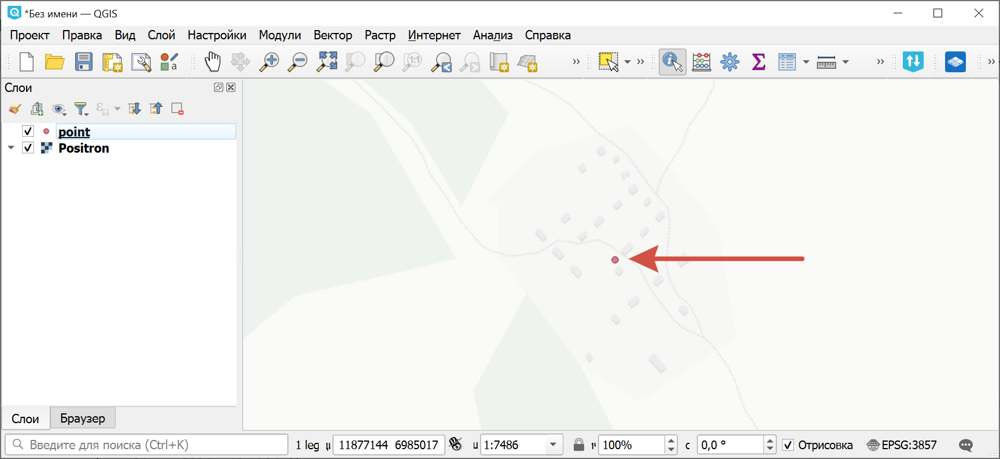
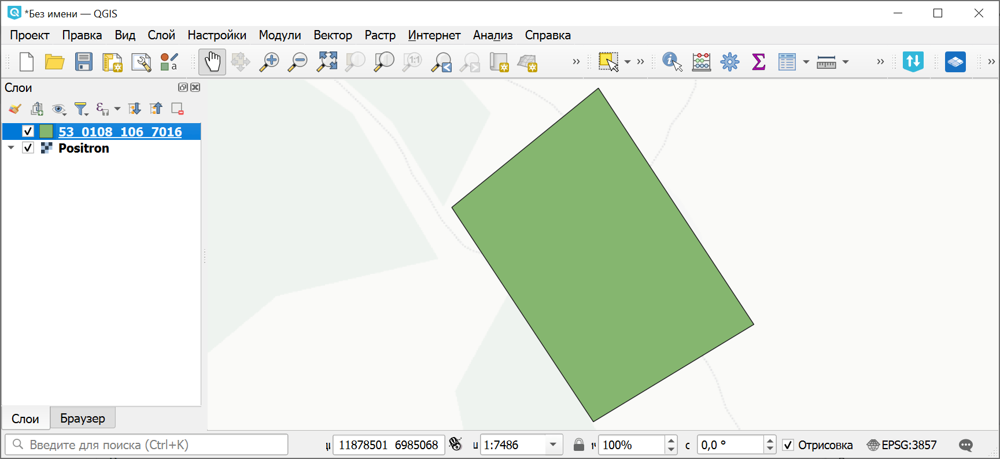

Геометрия кадастрового объекта по точке
=======================================

Извлечение геометрии и атрибутов кадастрового объекта по координатам одной входящей в него точки. Выходной формат: KML, GeoJSON.

На входе:

* Координаты точки: широта, долгота в десятичных градусах или градусах, минутах и секундах. Примеры: ``53.0108, 106.7016`` или ``53°00'38.9"N, 106°42'05.8"E``;
* Тип объекта:

   * 1 - Земельный участок, 
   * 2 - Кадастровый квартал, 
   * 4 - Кадастровый округ, 
   * 5 - Объект капитального строительства, 
   * 10 - Зона с особыми условиями использования территорий (ЗОУИТ)

На выходе:

* Файл с геометрией объекта в формате GeoJSON;
* Файл с геометрией объекта в формате KML.

Запуск инструмента: https://toolbox.nextgis.com/t/rosreestr_from_coord

Пример работы инструмента:

   Пример исходных данных: точка внутри нужного участка

   Пример результата работы инструмента: полигон участка с кадастровым номером

**Попробуйте инструмент в действии, скачав наш пример:**

1. Нажмите кнопку **Демо** над формой инструмента. Поля будут автоматически заполнены демонстрационными значениями.
2. Нажмите кнопку **Запустить**.

.. admonition:: Связанные инструменты

   * `Геометрия участка по кадастровому номеру <https://toolbox.nextgis.com/t/rosreestr2coord?from-related-tools=1>`_
   * `Поиск по кадастровым номерам <https://toolbox.nextgis.com/t/cadnums_to_geodata?from-related-tools=1>`_
   * `Генерация изображения кадастрового участка по номеру <https://toolbox.nextgis.com/t/cadastre2img?from-related-tools=1>`_
   * `Конвертация данных ЕГРН <https://toolbox.nextgis.com/t/import_egrn?from-related-tools=1>`_